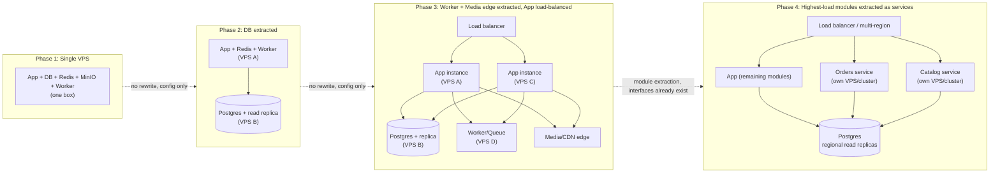

# goto5x.com — Architecture Diagram

Companion to `docs/SRS.md` §3 (System Architecture Overview). Two views: (1) module
boundaries inside the Phase 1 monolith, and (2) the four-phase scaling path, with
explicit extraction points marked.

---

## 1. Phase 1 — Modular Monolith on a Single VPS

```mermaid
flowchart TB
    subgraph Client["Clients"]
        Buyer["Buyer browser"]
        Seller["Seller dashboard"]
        SupplierUI["Supplier portal"]
        AdminUI["Admin terminal"]
    end

    subgraph VPS1["Single VPS (Phase 1)"]
        Traefik["Traefik\n(reverse proxy, per-domain auto-TLS)"]

        subgraph App["Node.js app (NestJS + Next.js) — stateless containers"]
            Auth["Auth / Identity module\n(SSO hook for future social SaaS)"]
            Tenant["Store/Tenant module"]
            Catalog["Catalog module\n(Products, Variants, Media,\nShipping/Tax Settings, Discount Codes,\nCollections, Search)"]
            Theme["Theme Engine module\n(templates, customizer, coded-theme mode,\nnavigation, announcement bar, coming-soon mode)"]
            OrdersM["Orders module\n(storefront + manual/draft orders,\nnotes/tags/timeline, carts)"]
            CommerceM["Commerce Ops module\n(Customers/CRM, Reviews,\nCSV import/export, PDF invoices)"]
            PaymentsM["Payments/Ledger module\n(commission + hold + reserve,\ngateway-agnostic)"]
            PayoutsM["Payouts module\n(approval queue, risk summary,\nDisbursement Adapter interface)"]
            SuppliersM["Suppliers module\n(Supplier Adapter interface\n+ adapter registry)"]
            AdminM["Admin module\n(Control Plane UI + content pages\n+ unit-economics dashboard\n+ external-API client registry)"]
            BridgesM["Bridges module (new in v0.6)\n(Template Install/License API,\nProduct Feed API)"]
            NotifyM["Notifications module"]
            Settings["Settings Registry service\n(SettingsService.resolve)\n— every module above calls this"]
        end

        Worker["Worker processes\n(stateless, consume BullMQ queue —\nincl. hold-release, reserve-release,\nscheduled-payout, abandoned-cart,\ndormant-store lifecycle, CSV import,\nPDF-generation jobs)"]
        Redis[("Redis\nsessions, rate limits, queue,\n+ settings cache namespace")]
        PgBouncer["PgBouncer\n(connection pooler)"]
        Postgres[("PostgreSQL\nRLS enforced per store_id\n+ settings_definitions/settings_values\n+ admin_audit_logs (insert-only grant)")]
        MinIO[("MinIO (self-hosted, S3-compatible)\nobject storage — media")]
    end

    subgraph Edge["Free-tier edge"]
        CDN["Cloudflare CDN (free tier)\nfronts MinIO for bandwidth offload"]
    end

    subgraph External["External services (paid or 3rd-party)"]
        Safepay["Safepay\n(Payment Adapter)\nv1.0: sole payment method"]
        CODNote["COD\n(Payment Adapter, gated)\noff for every seller at launch"]
        Printify["Printify\n(Supplier Adapter)"]
        CJ["CJ Dropshipping\n(Supplier Adapter)"]
        Drive["Google Drive\n(seller media import source)"]
        Email["Transactional email\n(one of the two self-host-first exceptions)"]
        Bank["Bank / Raast\n(v1.0 manual Disbursement Adapter:\nadmin transfers, marks Paid)"]
    end

    subgraph FounderSaaS["Founder's separate SaaS products (new in v0.6)"]
        TemplateStore["Template Store SaaS\n(premium template marketplace)\ncalls IN via Template Install/License API"]
        SocialSaaS["Social Media SaaS\n(post scheduling/marketing)\ncalled OUT via SSO + Product Feed API"]
    end

    Buyer & Seller & SupplierUI & AdminUI --> Traefik
    Traefik --> App
    App --> PgBouncer --> Postgres
    App --> Redis
    Worker --> Redis
    Worker --> PgBouncer
    App -. enqueue jobs .-> Redis
    Catalog --> MinIO
    Theme --> MinIO
    MinIO --> CDN
    PaymentsM --> Safepay
    PaymentsM -. gated, off at launch .-> CODNote
    PayoutsM -. manual adapter, v1.0 .-> Bank
    SuppliersM --> Printify
    SuppliersM --> CJ
    Catalog -. import .-> Drive
    NotifyM --> Email

    CommerceM --> MinIO

    TemplateStore -- "signed Template Install/\nLicense API call" --> BridgesM
    BridgesM -- "grants template_entitlements\n(FR-24.3)" --> Theme
    Auth -- SSO handoff, no 2nd login --> SocialSaaS
    BridgesM -- "seller-scoped, revocable\nProduct Feed API" --> SocialSaaS
    BridgesM -. resolve external-API client registry .-> Settings
    AdminM -- enable/disable external clients --> BridgesM

    Catalog -. resolve settings .-> Settings
    Theme -. resolve settings .-> Settings
    OrdersM -. resolve settings .-> Settings
    CommerceM -. resolve cart/low-stock/CSV settings .-> Settings
    PaymentsM -. resolve commission/hold/reserve/cod-gate settings .-> Settings
    PayoutsM -. resolve payout/reserve/scheduled-mode settings .-> Settings
    SuppliersM -. resolve settings + adapter registry .-> Settings
    AdminM -- writes settings + audit log\n(incl. free-plan limits,\ndormant-lifecycle thresholds) --> Settings
    Settings --> Redis
    Settings --> Postgres

    classDef module fill:#eef,stroke:#446,stroke-width:1px;
    classDef core fill:#fde,stroke:#a05,stroke-width:2px;
    class Auth,Tenant,Catalog,Theme,OrdersM,CommerceM,PaymentsM,PayoutsM,SuppliersM,AdminM,BridgesM,NotifyM module;
    class Settings core;
```

**Module boundary rule (SRS §3.1):** each module in the `App` box is a separate
NestJS module with its own folder, its own DB schema namespace, and talks to other
modules only through an internal service interface — never through shared mutable
state. This is what makes each module in the diagram above a candidate for
extraction later without touching the others.

**Supplier Adapter interface (SRS §3.5):** `SuppliersM` never contains
Printify-specific or CJ-specific branching logic. Each external supplier is a
plugin implementing the same interface (`listProducts`, `syncStock`,
`submitListingForReview`, `forwardOrder`, `pullTrackingUpdate`); adding AliExpress
later is "write one more adapter," never "modify SuppliersM."

**Payment Adapter interface (SRS §5.6a):** mirrors the same pattern — `PaymentsM`'s
commission/ledger logic never talks to Safepay/PayFast/JazzCash/Stripe directly, it
calls a Payment Adapter interface that each gateway integration implements. v1.0
wires up exactly one implementation (Safepay); the gated COD flow is documented in
the same enum/interface (SRS §5.6a) but switched off for every seller at launch.

**Disbursement Adapter interface (SRS §3.5, §5.6b — new in v0.4):** `PayoutsM` never
talks to a bank or Raast API directly. v1.0 ships the **manual adapter**: an approved
payout request renders on an admin batch screen (payee, amount, IBAN/account,
copy-ready) and the admin transfers funds outside the platform, then marks the
request Paid. Phase 1.x's API-based adapter (an actual bank/Raast/gateway payout
API) implements the same interface, so the approval queue, the ledger entries it
produces, and the seller-facing status flow (FR-6.12) never change when the
disbursement mechanism does — only the adapter implementation swaps.

**Settings Registry as a core dependency (SRS §3.8, §5.8 — highlighted in the
diagram):** every business-logic module — including the new `PayoutsM` — resolves
its tunable behavior (commission rate, hold duration, rolling-reserve percentage,
COD gating, product limits, template access, maintenance mode, payout freezes,
feature flags) through the Settings Registry service rather than a hard-coded
constant. This is drawn as a hub, not a peer module, because it is the mechanism
that makes the Admin Terminal an actual **control plane** instead of a reporting
dashboard: an admin write flows Admin UI → `AdminM` → `Settings` → `Postgres`
(durable) and `Redis` (cache invalidated), and the very next request any module
makes picks up the new value — no deploy, no restart. It runs as part of the same
app process on the same VPS, using the Postgres and Redis instances already
budgeted for Phase 1 — **this adds zero new infrastructure**, only new tables and
one more internal service class.

**Object storage (SRS §3.3, §9 — self-host-first, changed in v0.4):** media is
served from **self-hosted MinIO** (an S3-compatible container on the same VPS),
fronted by Cloudflare's free-tier CDN for bandwidth offload — not a paid object-
storage service. Because MinIO speaks the S3 API, a later migration to Cloudflare
R2 or AWS S3 (once volume genuinely justifies offloading storage operations) is a
configuration change — swap the endpoint and credentials — not a rewrite of
`Catalog`/`Theme`'s storage calls.

**Commerce Ops module (SRS §5.13–§5.20, new in v0.5):** Customers/CRM, product
reviews, CSV import/export, and PDF invoice generation are grouped into one module
rather than four, since they share a common shape (read-heavy, tenant-scoped
records layered on top of Catalog/Orders data) rather than being independent
subsystems. CSV import and PDF generation both run as **background jobs on the
existing Worker/BullMQ infrastructure** (§3.4) — a large catalog import or a PDF
render never blocks a request thread, and neither adds a new service: PDF
generation is a self-hosted, headless-browser-based renderer in the Worker
container (SRS §9 — self-host-first, no paid invoicing SaaS), and CSV files
(imports and exports) are read from/written to the same self-hosted MinIO already
used for media.

**Guard-rail jobs (SRS §5.23, new in v0.5):** the dormant-store lifecycle
(warning → suspend → archive) and free-plan storage/product-count enforcement run
as scheduled Worker jobs and inline checks respectively — both resolve their
thresholds through the Settings Registry exactly like every other tunable
behavior in this diagram, so changing a warning period or a storage quota is an
admin config change, never a deploy.

**Custom Domain & TLS (SRS §5.11/FR-11.2, Module 3):** a seller's domain-
verification flow (DNS check → Traefik dynamic-config file → real TLS probe)
is entirely app + filesystem, no new server. Traefik is configured with a
**file provider** (`--providers.file.directory`, `watch: true`) alongside its
existing Docker provider — the two are separate discovery mechanisms, so a
file-provider router referencing the Docker-discovered `web` container must
say `service: web@docker` (an explicit cross-provider reference), not a bare
`web`. TLS issuance itself is Traefik's own ACME client (HTTP-01 challenge,
docs/tech-stack.md) — the app never implements ACME; it only ever writes or
deletes a small YAML file per verified domain, which is what makes this
"automatic per-domain TLS" claim true without a custom cert-management
service.

**Theme Engine & Storefront Rendering (SRS FR-1.x/FR-11.2, Module 4):**
`apps/web` serves both the platform's own site and every tenant storefront
from one deployment, differentiated purely by the incoming Host header —
Next.js middleware rewrites any non-platform hostname under `/storefront`,
where a Server Component resolves the real store via the same public,
unauthenticated `/storefront/*` API a buyer's browser never sees directly.
Hostname resolution reuses Module 3's `domains` table (verified custom
domain first) and falls back to a `stores.slug`-based free subdomain —
one resolver, not two parallel lookup paths. `store_theme_settings` (tenant,
RLS-protected the same way as every other tenant table since Module 2) holds
the customizer's bounded token set (colors, fonts, logo/banner, section
show/hide/reorder — SRS Risk Register #10's deliberate scope limit); the
storefront and the seller-facing customizer's live preview render from the
*same* section components, so "live preview matches published output" is
true by construction. `sitemap.xml`/`robots.txt` are Next.js special files
that read the same resolved-store data per request (no static generation, no
cron) and honor `stores.access_mode` for the noindex/no-sitemap case.

**Discovery & Merchandising (SRS FR-16.x, Module 5):** extends the Theme
Engine's rendering layer, not a parallel one — `collections`/
`store_navigation_menus` are new tenant tables (same store_id-through-stores
RLS pattern as every tenant table since Module 2), while the announcement
bar, WhatsApp button, and FAQ accordion all extend `store_theme_settings`'s
existing customizer JSON rather than getting new tables, matching FR-16.4/
FR-16.7's own text ("a Theme Engine customizer setting"). Full-text search
(FR-16.2) reads `products.search_vector`, a Postgres `GENERATED ALWAYS AS
... STORED` tsvector column applied via a hand-written migration — Prisma's
migration diffing cannot manage a generated column, so this one migration
(and `stores.access_password_hash`) are applied with `migrate deploy`, never
`migrate dev`. The coming-soon/password gate (FR-16.5) is enforced inside
`StorefrontService` itself, not only in `apps/web` — the mobile-app-
readiness NFR (v0.7) means a future mobile client hitting the same API gets
the same 403, not a web-only check; the password-unlock credential is a
short-lived, store-scoped JWT signed with the existing `JWT_ACCESS_SECRET`
(no new secret introduced).

**Platform Event Log (SRS §3.11, new in v0.8):** every module writes its own
lifecycle events (`seller.signup`, `product.created`, `domain.verified`, etc.)
into one append-only `platform_events` table via a single `EventsService.emit()`
call — same "one reused mechanism, not one-off switches" philosophy as the
Settings Registry, and the same immutability discipline as `AdminM`'s audit
log. No new node in the diagram above: it's a cross-cutting write every
module makes into Postgres, not a service of its own. Nothing reads from it
yet — the admin analytics/unit-economics views (`AdminM`) are the intended
future readers.

**Bridges module — the two external-SaaS hooks (SRS §3.10, §5.24, new in v0.6):**
grouped into one small module because both hooks share the same shape — a
signed/authenticated API surface, gated by the `external_api_clients` registry
(mirroring `SuppliersM`'s adapter registry), rate-limited like every other public
endpoint. The **Template Store** calls **in**: a signed purchase-completion call
creates a `themes` entry (if new) and a `template_entitlements` row scoping it to
one seller — no template file is ever handed to the seller as a download, only an
entitlement to select it in the existing Theme Engine UI. The **Social Media
SaaS** is called **out** to: `Auth` hands a seller off via the existing SSO
mechanism (no second login), and a seller-scoped, revocable token
(`seller_api_tokens`) authorizes that SaaS to pull a read-only Product Feed
(title/price/images/storefront URL — nothing not already public on the
storefront). Both directions are **new API routes and two small tables only** —
no new server, no new database, no new paid service; disabling either client from
`AdminM`'s registry takes effect immediately and independently of the other.
**Referral attribution and cross-SaaS discount eligibility (SRS FR-24.13/24.14,
new in v0.7):** both hooks now carry a signed attribution signal on every SSO
handoff/API call (logged to `AdminAuditLog` as a system actor, no new table), and
`BridgesM` exposes one small signed read-only endpoint either SaaS can call to
check a seller's plan-based discount eligibility — goto5x.com never knows or
applies that SaaS's own discount terms, only answers the eligibility question.

**Template Package Spec (architecture decision, new v0.18 — pinned now, no
code, no rebuild of existing themes):** every storefront template, from the
three built-in v1.0 themes onward through everything the Template Store SaaS
will ever sell, is a **self-contained frontend package** and nothing more —
the backend (`ThemeEngineM`'s storefront data API and theme-settings tables)
never changes per template, and never will. A template package is:

- **Its own markup/styles/scripts** — the actual rendering code, isolated
  from every other template's code and from the seller/admin dashboard's own
  code. A template can only read the storefront data API and its own
  declared theme settings; it has no code path into another template's
  files, the dashboard's React tree, or any other seller's data. This is the
  same tenant-isolation discipline the rest of this SRS applies to data
  (§3.2) applied instead to **template code** — one bad or malicious template
  can degrade only its own storefront, never anyone else's.
- **Preview assets** — the screenshot(s)/thumbnail(s) the theme-selection UI
  (FR-1.1's built-in catalog, FR-24.2's premium showcase) renders in the
  picker, so a seller can evaluate a template without installing it first.
- **A manifest** declaring, at minimum:
  - `name` / `version` — identifies the package and its revision, the unit
    the Template Install/License API (FR-24.3) grants an entitlement against.
  - `settingsSchema` — the exact set of theme-settings keys this template
    reads (colors, fonts, layout toggles, etc.) and their types/defaults,
    validated against the existing `StoreThemeSettings` mechanism (Module 4)
    at install time — a template cannot invent settings the backend doesn't
    already support, and the backend doesn't need to know about any specific
    template's settings ahead of time.
  - Compatibility metadata (minimum platform/API version) so an incompatible
    package fails validation at install rather than at storefront render
    time.

**Validation and isolation are enforced at install, not at runtime trust:**
when the Template Install/License API (FR-24.3) registers a new template into
the `themes` catalog, the incoming package is validated against this manifest
spec — malformed or incompatible packages are rejected before they ever reach
a seller's storefront. Once installed, the isolation rule is structural, not a
policy note: a template's code is loaded and rendered in its own scope against
the shared storefront data API and its own declared settings only, exactly
the same integration surface every other template uses — so **the platform
never special-cases one template's implementation against another's**, and a
template misbehaving can never reach outside its own render boundary into the
dashboard or a different template.

**Staging (SRS §3.7):** not pictured above to keep the diagram readable, but staging
is a second instance of this entire box (`App`, `Worker`, `Redis`, `Postgres`,
`MinIO` — a separate Docker Compose project with its own containers and volumes)
running on the **same VPS** under a staging subdomain, at zero additional
infrastructure cost. It moves to its own VPS once cashflow supports it.

---

## 2. Scaling Path — Extraction Points



**Why each arrow is safe (verified against SRS §3.1/§3.3/§3.6 statelessness
principle):**

| Transition | What actually changes | What does NOT change |
|---|---|---|
| P1 → P2 | Point the app's DB connection string at a new host; enable a read replica | App code — it already goes through PgBouncer, never assumes a local DB |
| P2 → P3 | Add app instances behind a load balancer; move workers to their own box; optionally migrate MinIO to Cloudflare R2/AWS S3 for the "media/CDN edge" | Sessions — already stateless (JWT/Redis, never in-process); Workers — already stateless queue consumers; Media — already behind an S3-compatible API, not local disk, so switching providers is a config change |
| P3 → P4 | Extract Orders/Catalog modules into their own deployable, keep calling them through the same internal interfaces they already used inside the monolith | The module boundaries themselves — they were designed as if already separate services from Phase 1 (SRS §3.1) |

This table is the concrete answer to "does the single-VPS → multi-VPS path have any
rewrite traps": **no**, provided the four binding rules from SRS §3 are honored from
the first commit — app servers are stateless, sessions live in Redis/JWT not memory,
media lives in object storage not local disk, and DB access always goes through a
pooler.

**Beyond Phase 4 — region-sharded deployments (SRS §3.6, roadmap note only, new in
v0.7):** a further evolution not pictured above is a full per-region deployment —
its own DB + app/worker stack per region — with a global admin aggregation view
querying across regions for platform-wide analytics and control-plane actions.
No code for this ships now; it's documented so v1.0 modules don't hard-code a
single-region assumption beyond the i18n/currency rules already binding (SRS §3.9,
§2.5).
