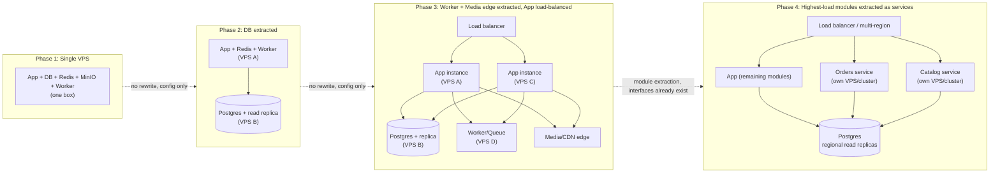

# goto5x.com — Architecture Diagram

Companion to `docs/SRS.md` §3 (System Architecture Overview). Two views: (1) module
boundaries inside the Phase 1 monolith, and (2) the four-phase scaling path, with
explicit extraction points marked.

---

## 1. Phase 1 — Modular Monolith on a Single VPS

```mermaid
flowchart TB
    subgraph Client["Clients"]
        Buyer["Buyer browser"]
        Seller["Seller dashboard"]
        SupplierUI["Supplier portal"]
        AdminUI["Admin terminal"]
    end

    subgraph VPS1["Single VPS (Phase 1)"]
        Traefik["Traefik\n(reverse proxy, per-domain auto-TLS)"]

        subgraph App["Node.js app (NestJS + Next.js) — stateless containers"]
            Auth["Auth / Identity module\n(SSO hook for future social SaaS)"]
            Tenant["Store/Tenant module"]
            Catalog["Catalog module\n(Products, Variants, Media,\nShipping/Tax Settings, Discount Codes,\nCollections, Search)"]
            Theme["Theme Engine module\n(templates, customizer, coded-theme mode,\nnavigation, announcement bar, coming-soon mode)"]
            OrdersM["Orders module\n(storefront + manual/draft orders,\nnotes/tags/timeline, carts)"]
            CommerceM["Commerce Ops module\n(Customers/CRM, Reviews,\nCSV import/export, PDF invoices)"]
            PaymentsM["Payments/Ledger module\n(commission + hold + reserve,\ngateway-agnostic)"]
            PayoutsM["Payouts module\n(approval queue, risk summary,\nDisbursement Adapter interface)"]
            SuppliersM["Suppliers module\n(Supplier Adapter interface\n+ adapter registry)"]
            AdminM["Admin module\n(Control Plane UI + content pages\n+ unit-economics dashboard)"]
            NotifyM["Notifications module"]
            Settings["Settings Registry service\n(SettingsService.resolve)\n— every module above calls this"]
        end

        Worker["Worker processes\n(stateless, consume BullMQ queue —\nincl. hold-release, reserve-release,\nscheduled-payout, abandoned-cart,\ndormant-store lifecycle, CSV import,\nPDF-generation jobs)"]
        Redis[("Redis\nsessions, rate limits, queue,\n+ settings cache namespace")]
        PgBouncer["PgBouncer\n(connection pooler)"]
        Postgres[("PostgreSQL\nRLS enforced per store_id\n+ settings_definitions/settings_values\n+ admin_audit_logs (insert-only grant)")]
        MinIO[("MinIO (self-hosted, S3-compatible)\nobject storage — media")]
    end

    subgraph Edge["Free-tier edge"]
        CDN["Cloudflare CDN (free tier)\nfronts MinIO for bandwidth offload"]
    end

    subgraph External["External services (paid or 3rd-party)"]
        Safepay["Safepay\n(Payment Adapter)\nv1.0: sole payment method"]
        CODNote["COD\n(Payment Adapter, gated)\noff for every seller at launch"]
        Printify["Printify\n(Supplier Adapter)"]
        CJ["CJ Dropshipping\n(Supplier Adapter)"]
        Drive["Google Drive\n(seller media import source)"]
        Email["Transactional email\n(one of the two self-host-first exceptions)"]
        Bank["Bank / Raast\n(v1.0 manual Disbursement Adapter:\nadmin transfers, marks Paid)"]
    end

    Buyer & Seller & SupplierUI & AdminUI --> Traefik
    Traefik --> App
    App --> PgBouncer --> Postgres
    App --> Redis
    Worker --> Redis
    Worker --> PgBouncer
    App -. enqueue jobs .-> Redis
    Catalog --> MinIO
    Theme --> MinIO
    MinIO --> CDN
    PaymentsM --> Safepay
    PaymentsM -. gated, off at launch .-> CODNote
    PayoutsM -. manual adapter, v1.0 .-> Bank
    SuppliersM --> Printify
    SuppliersM --> CJ
    Catalog -. import .-> Drive
    NotifyM --> Email

    CommerceM --> MinIO

    Catalog -. resolve settings .-> Settings
    Theme -. resolve settings .-> Settings
    OrdersM -. resolve settings .-> Settings
    CommerceM -. resolve cart/low-stock/CSV settings .-> Settings
    PaymentsM -. resolve commission/hold/reserve/cod-gate settings .-> Settings
    PayoutsM -. resolve payout/reserve/scheduled-mode settings .-> Settings
    SuppliersM -. resolve settings + adapter registry .-> Settings
    AdminM -- writes settings + audit log\n(incl. free-plan limits,\ndormant-lifecycle thresholds) --> Settings
    Settings --> Redis
    Settings --> Postgres

    classDef module fill:#eef,stroke:#446,stroke-width:1px;
    classDef core fill:#fde,stroke:#a05,stroke-width:2px;
    class Auth,Tenant,Catalog,Theme,OrdersM,CommerceM,PaymentsM,PayoutsM,SuppliersM,AdminM,NotifyM module;
    class Settings core;
```

**Module boundary rule (SRS §3.1):** each module in the `App` box is a separate
NestJS module with its own folder, its own DB schema namespace, and talks to other
modules only through an internal service interface — never through shared mutable
state. This is what makes each module in the diagram above a candidate for
extraction later without touching the others.

**Supplier Adapter interface (SRS §3.5):** `SuppliersM` never contains
Printify-specific or CJ-specific branching logic. Each external supplier is a
plugin implementing the same interface (`listProducts`, `syncStock`,
`submitListingForReview`, `forwardOrder`, `pullTrackingUpdate`); adding AliExpress
later is "write one more adapter," never "modify SuppliersM."

**Payment Adapter interface (SRS §5.6a):** mirrors the same pattern — `PaymentsM`'s
commission/ledger logic never talks to Safepay/PayFast/JazzCash/Stripe directly, it
calls a Payment Adapter interface that each gateway integration implements. v1.0
wires up exactly one implementation (Safepay); the gated COD flow is documented in
the same enum/interface (SRS §5.6a) but switched off for every seller at launch.

**Disbursement Adapter interface (SRS §3.5, §5.6b — new in v0.4):** `PayoutsM` never
talks to a bank or Raast API directly. v1.0 ships the **manual adapter**: an approved
payout request renders on an admin batch screen (payee, amount, IBAN/account,
copy-ready) and the admin transfers funds outside the platform, then marks the
request Paid. Phase 1.x's API-based adapter (an actual bank/Raast/gateway payout
API) implements the same interface, so the approval queue, the ledger entries it
produces, and the seller-facing status flow (FR-6.12) never change when the
disbursement mechanism does — only the adapter implementation swaps.

**Settings Registry as a core dependency (SRS §3.8, §5.8 — highlighted in the
diagram):** every business-logic module — including the new `PayoutsM` — resolves
its tunable behavior (commission rate, hold duration, rolling-reserve percentage,
COD gating, product limits, template access, maintenance mode, payout freezes,
feature flags) through the Settings Registry service rather than a hard-coded
constant. This is drawn as a hub, not a peer module, because it is the mechanism
that makes the Admin Terminal an actual **control plane** instead of a reporting
dashboard: an admin write flows Admin UI → `AdminM` → `Settings` → `Postgres`
(durable) and `Redis` (cache invalidated), and the very next request any module
makes picks up the new value — no deploy, no restart. It runs as part of the same
app process on the same VPS, using the Postgres and Redis instances already
budgeted for Phase 1 — **this adds zero new infrastructure**, only new tables and
one more internal service class.

**Object storage (SRS §3.3, §9 — self-host-first, changed in v0.4):** media is
served from **self-hosted MinIO** (an S3-compatible container on the same VPS),
fronted by Cloudflare's free-tier CDN for bandwidth offload — not a paid object-
storage service. Because MinIO speaks the S3 API, a later migration to Cloudflare
R2 or AWS S3 (once volume genuinely justifies offloading storage operations) is a
configuration change — swap the endpoint and credentials — not a rewrite of
`Catalog`/`Theme`'s storage calls.

**Commerce Ops module (SRS §5.13–§5.20, new in v0.5):** Customers/CRM, product
reviews, CSV import/export, and PDF invoice generation are grouped into one module
rather than four, since they share a common shape (read-heavy, tenant-scoped
records layered on top of Catalog/Orders data) rather than being independent
subsystems. CSV import and PDF generation both run as **background jobs on the
existing Worker/BullMQ infrastructure** (§3.4) — a large catalog import or a PDF
render never blocks a request thread, and neither adds a new service: PDF
generation is a self-hosted, headless-browser-based renderer in the Worker
container (SRS §9 — self-host-first, no paid invoicing SaaS), and CSV files
(imports and exports) are read from/written to the same self-hosted MinIO already
used for media.

**Guard-rail jobs (SRS §5.23, new in v0.5):** the dormant-store lifecycle
(warning → suspend → archive) and free-plan storage/product-count enforcement run
as scheduled Worker jobs and inline checks respectively — both resolve their
thresholds through the Settings Registry exactly like every other tunable
behavior in this diagram, so changing a warning period or a storage quota is an
admin config change, never a deploy.

**Staging (SRS §3.7):** not pictured above to keep the diagram readable, but staging
is a second instance of this entire box (`App`, `Worker`, `Redis`, `Postgres`,
`MinIO` — a separate Docker Compose project with its own containers and volumes)
running on the **same VPS** under a staging subdomain, at zero additional
infrastructure cost. It moves to its own VPS once cashflow supports it.

---

## 2. Scaling Path — Extraction Points



**Why each arrow is safe (verified against SRS §3.1/§3.3/§3.6 statelessness
principle):**

| Transition | What actually changes | What does NOT change |
|---|---|---|
| P1 → P2 | Point the app's DB connection string at a new host; enable a read replica | App code — it already goes through PgBouncer, never assumes a local DB |
| P2 → P3 | Add app instances behind a load balancer; move workers to their own box; optionally migrate MinIO to Cloudflare R2/AWS S3 for the "media/CDN edge" | Sessions — already stateless (JWT/Redis, never in-process); Workers — already stateless queue consumers; Media — already behind an S3-compatible API, not local disk, so switching providers is a config change |
| P3 → P4 | Extract Orders/Catalog modules into their own deployable, keep calling them through the same internal interfaces they already used inside the monolith | The module boundaries themselves — they were designed as if already separate services from Phase 1 (SRS §3.1) |

This table is the concrete answer to "does the single-VPS → multi-VPS path have any
rewrite traps": **no**, provided the four binding rules from SRS §3 are honored from
the first commit — app servers are stateless, sessions live in Redis/JWT not memory,
media lives in object storage not local disk, and DB access always goes through a
pooler.
