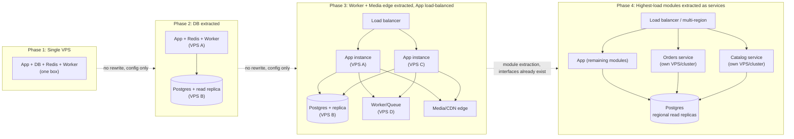

# goto5x.com — Architecture Diagram

Companion to `docs/SRS.md` §3 (System Architecture Overview). Two views: (1) module
boundaries inside the Phase 1 monolith, and (2) the four-phase scaling path, with
explicit extraction points marked.

---

## 1. Phase 1 — Modular Monolith on a Single VPS

```mermaid
flowchart TB
    subgraph Client["Clients"]
        Buyer["Buyer browser"]
        Seller["Seller dashboard"]
        SupplierUI["Supplier portal"]
        AdminUI["Admin terminal"]
    end

    subgraph VPS1["Single VPS (Phase 1)"]
        Traefik["Traefik\n(reverse proxy, per-domain auto-TLS)"]

        subgraph App["Node.js app (NestJS + Next.js) — stateless containers"]
            Auth["Auth / Identity module\n(SSO hook for future social SaaS)"]
            Tenant["Store/Tenant module"]
            Catalog["Catalog module\n(Products, Variants, Media)"]
            Theme["Theme Engine module\n(templates, customizer, coded-theme mode)"]
            OrdersM["Orders module"]
            PaymentsM["Payments/Ledger module\n(commission + hold, gateway-agnostic)"]
            SuppliersM["Suppliers module\n(Supplier Adapter interface)"]
            AdminM["Admin module\n(Control Plane UI)"]
            NotifyM["Notifications module"]
            Settings["Settings Registry service\n(SettingsService.resolve)\n— every module above calls this"]
        end

        Worker["Worker processes\n(stateless, consume BullMQ queue)"]
        Redis[("Redis\nsessions, rate limits, queue,\n+ settings cache namespace")]
        PgBouncer["PgBouncer\n(connection pooler)"]
        Postgres[("PostgreSQL\nRLS enforced per store_id\n+ settings_definitions/settings_values\n+ admin_audit_logs (insert-only grant)")]
    end

    subgraph External["External services"]
        R2[("Cloudflare R2 + CDN\nobject storage — media")]
        Safepay["Safepay / COD\n(Payment Adapter)"]
        Printify["Printify\n(Supplier Adapter)"]
        CJ["CJ Dropshipping\n(Supplier Adapter)"]
        Drive["Google Drive\n(seller media import source)"]
        Email["Transactional email"]
    end

    Buyer & Seller & SupplierUI & AdminUI --> Traefik
    Traefik --> App
    App --> PgBouncer --> Postgres
    App --> Redis
    Worker --> Redis
    Worker --> PgBouncer
    App -. enqueue jobs .-> Redis
    Catalog --> R2
    Theme --> R2
    PaymentsM --> Safepay
    SuppliersM --> Printify
    SuppliersM --> CJ
    Catalog -. import .-> Drive
    NotifyM --> Email

    Catalog -. resolve settings .-> Settings
    Theme -. resolve settings .-> Settings
    OrdersM -. resolve settings .-> Settings
    PaymentsM -. resolve commission/hold/frozen settings .-> Settings
    SuppliersM -. resolve settings .-> Settings
    AdminM -- writes settings + audit log --> Settings
    Settings --> Redis
    Settings --> Postgres

    classDef module fill:#eef,stroke:#446,stroke-width:1px;
    classDef core fill:#fde,stroke:#a05,stroke-width:2px;
    class Auth,Tenant,Catalog,Theme,OrdersM,PaymentsM,SuppliersM,AdminM,NotifyM module;
    class Settings core;
```

**Module boundary rule (SRS §3.1):** each module in the `App` box is a separate
NestJS module with its own folder, its own DB schema namespace, and talks to other
modules only through an internal service interface — never through shared mutable
state. This is what makes each module in the diagram above a candidate for
extraction later without touching the others.

**Supplier Adapter interface (SRS §3.5):** `SuppliersM` never contains
Printify-specific or CJ-specific branching logic. Each external supplier is a
plugin implementing the same interface (`listProducts`, `syncStock`,
`submitListingForReview`, `forwardOrder`, `pullTrackingUpdate`); adding AliExpress
later is "write one more adapter," never "modify SuppliersM."

**Payment Adapter interface (SRS §5.6a):** mirrors the same pattern — `PaymentsM`'s
commission/ledger logic never talks to Safepay/PayFast/JazzCash/Stripe directly, it
calls a Payment Adapter interface that each gateway integration implements.

**Settings Registry as a core dependency (SRS §3.8, §5.8 — highlighted in the
diagram):** every business-logic module resolves its tunable behavior (commission
rate, product limits, template access, maintenance mode, payout freezes, feature
flags) through the Settings Registry service rather than a hard-coded constant. This
is drawn as a hub, not a peer module, because it is the mechanism that makes the
Admin Terminal an actual **control plane** instead of a reporting dashboard: an admin
write flows Admin UI → `AdminM` → `Settings` → `Postgres` (durable) and
`Redis` (cache invalidated), and the very next request any module makes picks up the
new value — no deploy, no restart. It runs as part of the same app process on the
same VPS, using the Postgres and Redis instances already budgeted for Phase 1 —
**this adds zero new infrastructure**, only new tables and one more internal service
class.

---

## 2. Scaling Path — Extraction Points

**Why each arrow is safe (verified against SRS §3.1/§3.3/§3.6 statelessness
principle):**

| Transition | What actually changes | What does NOT change |
|---|---|---|
| P1 → P2 | Point the app's DB connection string at a new host; enable a read replica | App code — it already goes through PgBouncer, never assumes a local DB |
| P2 → P3 | Add app instances behind a load balancer; move workers to their own box | Sessions — already stateless (JWT/Redis, never in-process); Workers — already stateless queue consumers; Media — already in R2, not local disk |
| P3 → P4 | Extract Orders/Catalog modules into their own deployable, keep calling them through the same internal interfaces they already used inside the monolith | The module boundaries themselves — they were designed as if already separate services from Phase 1 (SRS §3.1) |

This table is the concrete answer to "does the single-VPS → multi-VPS path have any
rewrite traps": **no**, provided the four binding rules from SRS §3 are honored from
the first commit — app servers are stateless, sessions live in Redis/JWT not memory,
media lives in object storage not local disk, and DB access always goes through a
pooler.
