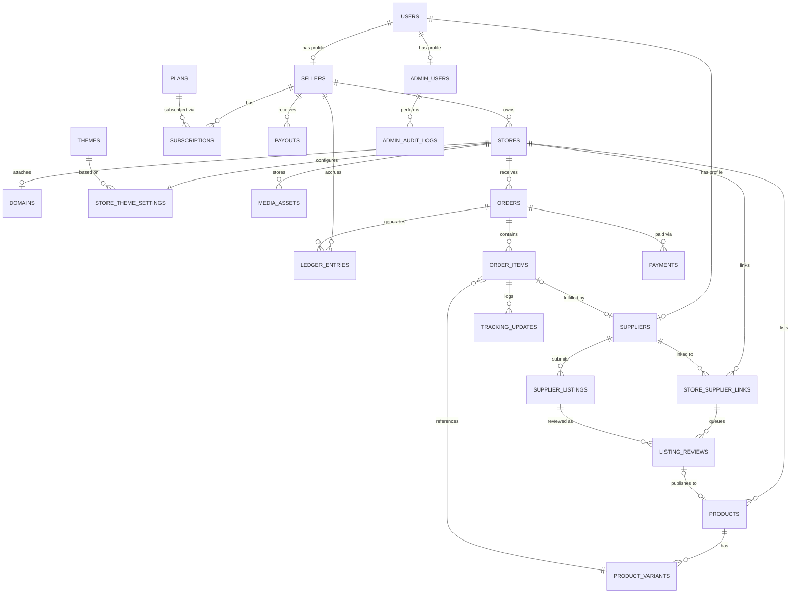

# goto5x.com — Database Schema (v1)

PostgreSQL. All timestamps `timestamptz`. All primary keys `uuid` unless noted.
Companion to `docs/SRS.md` §3.2 (tenant isolation) and §8 (entity list).

## Tenant strategy

- Every **directly** tenant-owned table carries `store_id`.
- Child tables that logically belong to a tenant row through a parent FK
  (`order_items` → `orders`, `product_variants` → `products`,
  `tracking_updates` → `order_items`, `listing_reviews` → `store_supplier_links`)
  **also get `store_id` denormalized onto them directly.** This is a deliberate
  normalization trade-off: Postgres Row-Level Security (SRS §3.2) needs a direct
  column to filter on — a policy that requires joining up to a parent table to find
  `store_id` is slower and, more importantly, harder to prove correct for every query
  path. A flat `store_id` on every tenant row makes the RLS policy identical
  (`USING (store_id = current_setting('app.store_id')::uuid)`) everywhere, with no
  exceptions to reason about.
- Global (platform-level, not tenant-owned) tables: `users`, `suppliers`,
  `supplier_listings`, `themes`, `plans`, `admin_users`, `admin_audit_logs`,
  `feature_flags`.
- `ledger_entries` and `payouts` are scoped by `seller_id`, not `store_id` (a seller
  may own more than one store; payout accounting is per-seller, not per-store) — the
  same "own-row-only" access rule applies, enforced the same way as tenant RLS.

---

## Entity-relationship overview

---

## Table definitions

### `users` (global — shared identity, SSO hook per SRS §3.2a)
| Column | Type | Notes |
|---|---|---|
| id | uuid PK | |
| email | text unique | |
| phone | text nullable | |
| password_hash | text nullable | null if OAuth-only |
| role_flags | text[] | e.g. `{seller}`, `{supplier,seller}` — one user can hold multiple role profiles |
| mfa_enabled | boolean default false | mandatory `true` enforced at app layer for `admin_users` (FR-8.11) |
| email_verified_at | timestamptz nullable | |
| created_at, updated_at | timestamptz | |

### `sellers` (global profile, owns tenant stores)
| Column | Type | Notes |
|---|---|---|
| id | uuid PK | |
| user_id | uuid FK → users.id, unique | |
| business_name | text | |
| kyc_status | enum(`unverified`,`pending`,`verified`) | drives hold graduation, FR-6.3 |
| kyc_verified_at | timestamptz nullable | |
| created_at, updated_at | timestamptz | |

### `stores` (tenant root)
| Column | Type | Notes |
|---|---|---|
| id | uuid PK | this **is** the `store_id` referenced everywhere |
| seller_id | uuid FK → sellers.id | |
| name | text | |
| slug | text unique | subdomain: `slug.goto5x.com` |
| status | enum(`active`,`suspended`,`banned`) | drives FR-5.3 buyer-facing behavior |
| created_at, updated_at | timestamptz | |

Index: `idx_stores_seller_id (seller_id)`.

### `domains`
| Column | Type | Notes |
|---|---|---|
| id | uuid PK | |
| store_id | uuid FK → stores.id | |
| domain_name | text unique | **unique index is the hot path** — every inbound request resolves its tenant by looking up the request hostname here first |
| verification_status | enum(`pending`,`verified`,`failed`) | |
| tls_status | enum(`pending`,`issued`,`error`) | |
| verified_at | timestamptz nullable | |

Index: `idx_domains_domain_name (domain_name)` unique — critical for per-request tenant resolution latency.

### `themes` (global template catalog)
| Column | Type | Notes |
|---|---|---|
| id | uuid PK | |
| name | text | |
| tier | enum(`free`,`premium`) | |
| preview_image_url | text | |
| version | text | |
| is_active | boolean | retired themes stay for existing stores but drop from selection (FR-8.5) |

### `store_theme_settings` (tenant, 1:1 with store)
| Column | Type | Notes |
|---|---|---|
| id | uuid PK | |
| store_id | uuid FK → stores.id, unique | |
| theme_id | uuid FK → themes.id | |
| settings | jsonb | colors, fonts, section layout, animation presets (FR-1.2) |
| custom_code | text nullable | coded-theme escape hatch (FR-1.6), gated by plan at the app layer |
| updated_at | timestamptz | |

### `products` (tenant)
| Column | Type | Notes |
|---|---|---|
| id | uuid PK | |
| store_id | uuid FK → stores.id | |
| title | text | |
| description | text | |
| status | enum(`draft`,`active`,`archived`) | |
| source_type | enum(`self`,`supplier`) | |
| created_at, updated_at | timestamptz | |

Index: `idx_products_store_status (store_id, status)` — storefront catalog browsing, the highest-QPS read in the system.

### `product_variants` (tenant, child of products)
| Column | Type | Notes |
|---|---|---|
| id | uuid PK | |
| store_id | uuid | denormalized for RLS |
| product_id | uuid FK → products.id | |
| sku | text | |
| price | numeric(12,2) | |
| compare_at_price | numeric(12,2) nullable | |
| stock_quantity | integer | for supplier-sourced variants, mirrors the shared supplier stock figure (FR-4.5) |
| attributes | jsonb | size/color/etc. |

Index: `idx_variants_product_id (product_id)`.

### `media_assets` (tenant)
| Column | Type | Notes |
|---|---|---|
| id | uuid PK | |
| store_id | uuid FK → stores.id | |
| product_id | uuid FK → products.id, nullable | |
| url | text | object-storage (R2) URL, not a Drive URL (FR-9.2) |
| source | enum(`upload`,`google_drive_import`) | |
| type | enum(`image`,`video`) | |
| created_at | timestamptz | |

Index: `idx_media_store_id (store_id)`, `idx_media_product_id (product_id)`.

### `suppliers` (global profile)
| Column | Type | Notes |
|---|---|---|
| id | uuid PK | |
| user_id | uuid FK → users.id, unique | |
| business_name | text | |
| verification_status | enum(`pending`,`verified`,`rejected`) | |
| created_at | timestamptz | |

### `store_supplier_links` (join table — the core of the multi-store supplier dashboard)
| Column | Type | Notes |
|---|---|---|
| id | uuid PK | |
| store_id | uuid FK → stores.id | |
| supplier_id | uuid FK → suppliers.id | |
| status | enum(`pending_seller_review`,`active`,`revoked`) | |
| invited_by | enum(`seller`,`supplier`) | supports FR-2.6 seller-initiated invite AND supplier self-registration |
| approved_at | timestamptz nullable | |
| created_at | timestamptz | |

Unique: `(store_id, supplier_id)`. Index: `idx_ssl_supplier_status (supplier_id, status)` — **this is the query behind the supplier's multi-store dashboard** (FR-3.3): "all stores I'm actively linked to."

### `supplier_listings` (global — a supplier's catalog, adapter-sourced per SRS §3.5)
| Column | Type | Notes |
|---|---|---|
| id | uuid PK | |
| supplier_id | uuid FK → suppliers.id | |
| adapter_type | enum(`printify`,`cj_dropshipping`,`manual`,...) | extend this enum only — never branch core code (§3.5) |
| external_product_id | text | supplier-side ID |
| title | text | |
| price | numeric(12,2) | |
| stock_quantity | integer | the shared figure FR-4.5 decrements against |
| raw_payload | jsonb | adapter-specific data, kept for debugging/resync |
| updated_at | timestamptz | last successful sync (FR-4.3) |

### `listing_reviews` (tenant via link, the seller approval queue)
| Column | Type | Notes |
|---|---|---|
| id | uuid PK | |
| store_id | uuid | denormalized for RLS |
| store_supplier_link_id | uuid FK → store_supplier_links.id | |
| supplier_listing_id | uuid FK → supplier_listings.id | |
| status | enum(`pending`,`approved`,`rejected`) | no auto-publish path (FR-2.7) |
| reviewed_by | uuid FK → users.id, nullable | |
| reviewed_at | timestamptz nullable | |
| product_id | uuid FK → products.id, nullable | set once approved and published into the store's catalog |

Index: `idx_listing_reviews_link_status (store_supplier_link_id, status)`.

### `orders` (tenant)
| Column | Type | Notes |
|---|---|---|
| id | uuid PK | |
| store_id | uuid FK → stores.id | |
| buyer_id | uuid FK → users.id, nullable | null for guest checkout |
| buyer_email | text | |
| shipping_address | jsonb | |
| status | enum(`pending`,`confirmed`,`shipped`,`delivered`,`completed`,`cancelled`,`disputed`) | |
| total_amount | numeric(12,2) | |
| currency | text default `PKR` | |
| placed_at | timestamptz | |

Index: `idx_orders_store_status_date (store_id, status, placed_at desc)` — the seller order dashboard's primary query (filter by status, sort by date).

### `order_items` (tenant, child of orders)
| Column | Type | Notes |
|---|---|---|
| id | uuid PK | |
| store_id | uuid | denormalized for RLS |
| order_id | uuid FK → orders.id | |
| product_id | uuid FK → products.id | |
| variant_id | uuid FK → product_variants.id | |
| supplier_id | uuid FK → suppliers.id, nullable | null if self-fulfilled |
| quantity | integer | |
| unit_price | numeric(12,2) | |
| fulfillment_status | enum(`pending`,`confirmed`,`shipped`,`delivered`,`completed`) | the literal per-order checklist, FR-3.4 |

Index: `idx_order_items_supplier_status (supplier_id, fulfillment_status, created_at)` — **the query behind the supplier's multi-store order tracking view**: every order-item across every linked store, filterable by status. Index: `idx_order_items_order_id (order_id)`.

### `tracking_updates`
| Column | Type | Notes |
|---|---|---|
| id | uuid PK | |
| order_item_id | uuid FK → order_items.id | |
| tracking_id | text | |
| carrier | text nullable | |
| uploaded_by | uuid FK → users.id | supplier's user id |
| uploaded_at | timestamptz | |

Index: `idx_tracking_order_item (order_item_id)`.

### `payments`
| Column | Type | Notes |
|---|---|---|
| id | uuid PK | |
| store_id | uuid | denormalized for RLS |
| order_id | uuid FK → orders.id | |
| gateway | enum(`safepay`,`cod`,`payfast`,`jazzcash`,`easypaisa`,`stripe`) | mirrors the Payment Adapter interface, SRS §5.6a |
| gateway_transaction_id | text nullable unique | null for COD |
| amount | numeric(12,2) | |
| status | enum(`pending`,`succeeded`,`failed`,`refunded`) | |
| raw_webhook_payload | jsonb nullable | only ever written after signature verification (SRS §6.5) |
| created_at | timestamptz | |

Index: `idx_payments_gateway_txn (gateway_transaction_id)` unique — idempotent webhook handling.

### `ledger_entries` (append-only — single source of truth for balances, seller-scoped)
| Column | Type | Notes |
|---|---|---|
| id | uuid PK | |
| seller_id | uuid FK → sellers.id | |
| order_id | uuid FK → orders.id, nullable | |
| type | enum(`sale_credit`,`commission_debit`,`gateway_fee_debit`,`hold_release`,`payout_debit`,`refund_adjustment`) | |
| amount | numeric(12,2) | signed (+/-) |
| balance_bucket | enum(`pending`,`available`) | |
| hold_release_at | timestamptz nullable | set on `sale_credit` rows for the hold-release scheduled job (FR-6.2) |
| created_at | timestamptz | never updated — corrections are new offsetting rows, never edits |

Index: `idx_ledger_seller_created (seller_id, created_at)` — balance computation. Partial index:
`idx_ledger_pending_release ON ledger_entries (hold_release_at) WHERE balance_bucket = 'pending'`
— this is the query the hold-release scheduled job runs every run: "which pending entries are past their release time," and it must not scan the whole table to find them.

### `payouts` (seller-scoped)
| Column | Type | Notes |
|---|---|---|
| id | uuid PK | |
| seller_id | uuid FK → sellers.id | |
| amount | numeric(12,2) | |
| status | enum(`scheduled`,`processing`,`paid`,`failed`) | |
| payout_method | text | |
| requested_at, paid_at | timestamptz nullable | |

Index: `idx_payouts_seller_status (seller_id, status)`.

### `plans` (global)
| Column | Type | Notes |
|---|---|---|
| id | uuid PK | |
| name | text | Starter / Growth / Premium |
| price_pkr | numeric(12,2) | |
| billing_interval | enum(`monthly`,`yearly`) | |
| commission_rate_override | numeric(5,4) nullable | overrides the platform default 3% (FR-6.1) |
| feature_flags | jsonb | product limit, template tier, coded-theme access, custom domain, etc. |

### `subscriptions`
| Column | Type | Notes |
|---|---|---|
| id | uuid PK | |
| seller_id | uuid FK → sellers.id | |
| plan_id | uuid FK → plans.id | |
| status | enum(`active`,`past_due`,`cancelled`) | |
| current_period_end | timestamptz | |

Index: `idx_subscriptions_seller (seller_id)`.

### `admin_users` (global)
| Column | Type | Notes |
|---|---|---|
| id | uuid PK | |
| user_id | uuid FK → users.id, unique | |
| role | enum(`super_admin`,`support`) | `support` sub-role reserved for Phase 3 (§4 of SRS) |
| mfa_enabled | boolean | must be `true` — enforced at signup, not just a settable flag (FR-8.11) |

### `admin_audit_logs` (global, immutable)
| Column | Type | Notes |
|---|---|---|
| id | uuid PK | |
| admin_user_id | uuid FK → admin_users.id | |
| action | text | e.g. `seller.suspend`, `commission.update` |
| target_type | text | e.g. `store`, `seller`, `plan` |
| target_id | uuid | |
| metadata | jsonb | before/after values |
| created_at | timestamptz | |

Index: `idx_audit_admin_created (admin_user_id, created_at)`, `idx_audit_target (target_type, target_id)`.

### `feature_flags` (global)
| Column | Type | Notes |
|---|---|---|
| id | uuid PK | |
| key | text unique | |
| enabled_globally | boolean | |
| enabled_for_store_ids | uuid[] nullable | staged rollout to specific tenants (FR-8.9) |

---

## Heavy-query index summary (why each exists)

| Query | Index |
|---|---|
| Seller order dashboard (filter by status, sort by date) | `orders (store_id, status, placed_at desc)` |
| Supplier multi-store dashboard (all order-items across linked stores) | `order_items (supplier_id, fulfillment_status, created_at)` |
| Supplier's list of linked stores | `store_supplier_links (supplier_id, status)` |
| Storefront catalog browsing | `products (store_id, status)` |
| Tenant resolution by custom domain (every request) | `domains (domain_name)` unique |
| Balance computation + hold-release job | `ledger_entries (seller_id, created_at)` + partial `ledger_entries (hold_release_at) WHERE balance_bucket='pending'` |
| Idempotent payment webhook handling | `payments (gateway_transaction_id)` unique |
| Listing approval queue | `listing_reviews (store_supplier_link_id, status)` |

## Extensibility deliberately not modeled yet

Coupons/discounts, product reviews, and multi-currency pricing are not in the v1
schema because they are not in the SRS's functional requirements — adding them later
is a new table + FKs, not a redesign, because tenancy (`store_id`) and the ledger
pattern already generalize to them.
