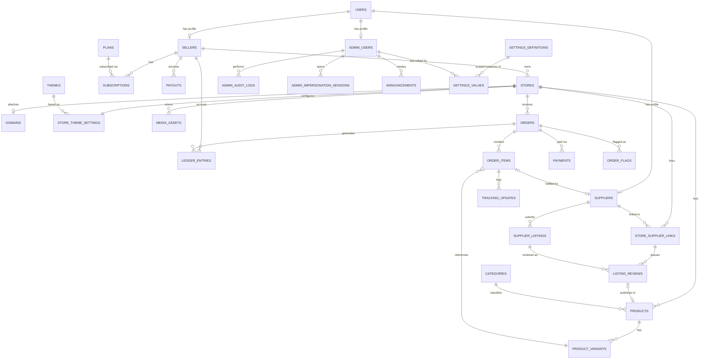

# goto5x.com — Database Schema (v1)

PostgreSQL. All timestamps `timestamptz`. All primary keys `uuid` unless noted.
Companion to `docs/SRS.md` §3.2 (tenant isolation) and §8 (entity list).

## Tenant strategy

- Every **directly** tenant-owned table carries `store_id`.
- Child tables that logically belong to a tenant row through a parent FK
  (`order_items` → `orders`, `product_variants` → `products`,
  `tracking_updates` → `order_items`, `listing_reviews` → `store_supplier_links`)
  **also get `store_id` denormalized onto them directly.** This is a deliberate
  normalization trade-off: Postgres Row-Level Security (SRS §3.2) needs a direct
  column to filter on — a policy that requires joining up to a parent table to find
  `store_id` is slower and, more importantly, harder to prove correct for every query
  path. A flat `store_id` on every tenant row makes the RLS policy identical
  (`USING (store_id = current_setting('app.store_id')::uuid)`) everywhere, with no
  exceptions to reason about.
- Global (platform-level, not tenant-owned) tables: `users`, `suppliers`,
  `supplier_listings`, `themes`, `plans`, `categories`, `admin_users`,
  `admin_audit_logs`, `admin_impersonation_sessions`, `settings_definitions`,
  `settings_values`, `announcements`.
- **v0.3 change:** the earlier standalone `feature_flags` table is retired in favor of
  the generic **Settings Registry** (`settings_definitions` + `settings_values`,
  detailed below) — a feature flag is simply a boolean-typed, scoped setting, not a
  separate mechanism. This is the schema half of SRS §3.8/§5.8 (Admin Control Plane).
- `ledger_entries` and `payouts` are scoped by `seller_id`, not `store_id` (a seller
  may own more than one store; payout accounting is per-seller, not per-store) — the
  same "own-row-only" access rule applies, enforced the same way as tenant RLS.

---

## Entity-relationship overview

Every module in the architecture (Catalog, Orders, Payments/Ledger, Suppliers, Theme
Engine) reads its tunable behavior through `SETTINGS_DEFINITIONS`/`SETTINGS_VALUES` —
this pair is the schema backbone of the Admin Control Plane (SRS §3.8, §5.8) and is
intentionally drawn as a hub rather than tucked away as "just another table."

---

## Table definitions

### `users` (global — shared identity, SSO hook per SRS §3.2a)
| Column | Type | Notes |
|---|---|---|
| id | uuid PK | |
| email | text unique | |
| phone | text nullable | |
| password_hash | text nullable | null if OAuth-only |
| role_flags | text[] | e.g. `{seller}`, `{supplier,seller}` — one user can hold multiple role profiles |
| mfa_enabled | boolean default false | mandatory `true` enforced at app layer for `admin_users` (FR-8.11) |
| email_verified_at | timestamptz nullable | |
| created_at, updated_at | timestamptz | |

### `sellers` (global profile, owns tenant stores)
| Column | Type | Notes |
|---|---|---|
| id | uuid PK | |
| user_id | uuid FK → users.id, unique | |
| business_name | text | |
| kyc_status | enum(`unverified`,`pending`,`verified`) | drives hold graduation, FR-6.3 |
| kyc_verified_at | timestamptz nullable | |
| created_at, updated_at | timestamptz | |

### `stores` (tenant root)
| Column | Type | Notes |
|---|---|---|
| id | uuid PK | this **is** the `store_id` referenced everywhere |
| seller_id | uuid FK → sellers.id | |
| name | text | |
| slug | text unique | subdomain: `slug.goto5x.com` |
| status | enum(`active`,`suspended`,`banned`) | drives FR-5.3 buyer-facing behavior |
| created_at, updated_at | timestamptz | |

Index: `idx_stores_seller_id (seller_id)`.

### `domains`
| Column | Type | Notes |
|---|---|---|
| id | uuid PK | |
| store_id | uuid FK → stores.id | |
| domain_name | text unique | **unique index is the hot path** — every inbound request resolves its tenant by looking up the request hostname here first |
| verification_status | enum(`pending`,`verified`,`failed`) | |
| tls_status | enum(`pending`,`issued`,`error`) | |
| verified_at | timestamptz nullable | |

Index: `idx_domains_domain_name (domain_name)` unique — critical for per-request tenant resolution latency.

### `themes` (global template catalog)
| Column | Type | Notes |
|---|---|---|
| id | uuid PK | |
| name | text | |
| tier | enum(`free`,`premium`) | |
| preview_image_url | text | |
| version | text | |
| is_active | boolean | retired themes stay for existing stores but drop from selection (FR-8.5) |

### `store_theme_settings` (tenant, 1:1 with store)
| Column | Type | Notes |
|---|---|---|
| id | uuid PK | |
| store_id | uuid FK → stores.id, unique | |
| theme_id | uuid FK → themes.id | |
| settings | jsonb | colors, fonts, section layout, animation presets (FR-1.2) |
| custom_code | text nullable | coded-theme escape hatch (FR-1.6), gated by plan at the app layer |
| updated_at | timestamptz | |

### `products` (tenant)
| Column | Type | Notes |
|---|---|---|
| id | uuid PK | |
| store_id | uuid FK → stores.id | |
| category_id | uuid FK → categories.id, nullable | drives category-level commission overrides (FR-6.1/FR-8.3) and storefront browsing |
| title | text | |
| description | text | |
| status | enum(`draft`,`active`,`archived`) | |
| source_type | enum(`self`,`supplier`) | |
| created_at, updated_at | timestamptz | |

Index: `idx_products_store_status (store_id, status)` — storefront catalog browsing, the highest-QPS read in the system.

### `categories` (global — admin-managed taxonomy)
| Column | Type | Notes |
|---|---|---|
| id | uuid PK | |
| name | text | e.g. "Electronics", "Fashion", "Home" |
| slug | text unique | |
| created_at | timestamptz | |

Admin-managed (part of the Control Plane, SRS FR-8.3) specifically so commission can
be tuned per category via the Settings Registry without a schema change per category.

### `product_variants` (tenant, child of products)
| Column | Type | Notes |
|---|---|---|
| id | uuid PK | |
| store_id | uuid | denormalized for RLS |
| product_id | uuid FK → products.id | |
| sku | text | |
| price | numeric(12,2) | |
| compare_at_price | numeric(12,2) nullable | |
| stock_quantity | integer | for supplier-sourced variants, mirrors the shared supplier stock figure (FR-4.5) |
| attributes | jsonb | size/color/etc. |

Index: `idx_variants_product_id (product_id)`.

### `media_assets` (tenant)
| Column | Type | Notes |
|---|---|---|
| id | uuid PK | |
| store_id | uuid FK → stores.id | |
| product_id | uuid FK → products.id, nullable | |
| url | text | object-storage (R2) URL, not a Drive URL (FR-9.2) |
| source | enum(`upload`,`google_drive_import`) | |
| type | enum(`image`,`video`) | |
| created_at | timestamptz | |

Index: `idx_media_store_id (store_id)`, `idx_media_product_id (product_id)`.

### `suppliers` (global profile)
| Column | Type | Notes |
|---|---|---|
| id | uuid PK | |
| user_id | uuid FK → users.id, unique | |
| business_name | text | |
| verification_status | enum(`pending`,`verified`,`rejected`) | |
| created_at | timestamptz | |

### `store_supplier_links` (join table — the core of the multi-store supplier dashboard)
| Column | Type | Notes |
|---|---|---|
| id | uuid PK | |
| store_id | uuid FK → stores.id | |
| supplier_id | uuid FK → suppliers.id | |
| status | enum(`pending_seller_review`,`active`,`revoked`) | |
| invited_by | enum(`seller`,`supplier`) | supports FR-2.6 seller-initiated invite AND supplier self-registration |
| approved_at | timestamptz nullable | |
| created_at | timestamptz | |

Unique: `(store_id, supplier_id)`. Index: `idx_ssl_supplier_status (supplier_id, status)` — **this is the query behind the supplier's multi-store dashboard** (FR-3.3): "all stores I'm actively linked to."

### `supplier_listings` (global — a supplier's catalog, adapter-sourced per SRS §3.5)
| Column | Type | Notes |
|---|---|---|
| id | uuid PK | |
| supplier_id | uuid FK → suppliers.id | |
| adapter_type | enum(`printify`,`cj_dropshipping`,`manual`,...) | extend this enum only — never branch core code (§3.5) |
| external_product_id | text | supplier-side ID |
| title | text | |
| price | numeric(12,2) | |
| stock_quantity | integer | the shared figure FR-4.5 decrements against |
| raw_payload | jsonb | adapter-specific data, kept for debugging/resync |
| updated_at | timestamptz | last successful sync (FR-4.3) |

### `listing_reviews` (tenant via link, the seller approval queue)
| Column | Type | Notes |
|---|---|---|
| id | uuid PK | |
| store_id | uuid | denormalized for RLS |
| store_supplier_link_id | uuid FK → store_supplier_links.id | |
| supplier_listing_id | uuid FK → supplier_listings.id | |
| status | enum(`pending`,`approved`,`rejected`) | no auto-publish path (FR-2.7) |
| reviewed_by | uuid FK → users.id, nullable | |
| reviewed_at | timestamptz nullable | |
| product_id | uuid FK → products.id, nullable | set once approved and published into the store's catalog |

Index: `idx_listing_reviews_link_status (store_supplier_link_id, status)`.

### `orders` (tenant)
| Column | Type | Notes |
|---|---|---|
| id | uuid PK | |
| store_id | uuid FK → stores.id | |
| buyer_id | uuid FK → users.id, nullable | null for guest checkout |
| buyer_email | text | |
| shipping_address | jsonb | |
| status | enum(`pending`,`confirmed`,`shipped`,`delivered`,`completed`,`cancelled`,`disputed`) | |
| total_amount | numeric(12,2) | |
| currency | text default `PKR` | |
| placed_at | timestamptz | |

Index: `idx_orders_store_status_date (store_id, status, placed_at desc)` — the seller order dashboard's primary query (filter by status, sort by date).

### `order_items` (tenant, child of orders)
| Column | Type | Notes |
|---|---|---|
| id | uuid PK | |
| store_id | uuid | denormalized for RLS |
| order_id | uuid FK → orders.id | |
| product_id | uuid FK → products.id | |
| variant_id | uuid FK → product_variants.id | |
| supplier_id | uuid FK → suppliers.id, nullable | null if self-fulfilled |
| quantity | integer | |
| unit_price | numeric(12,2) | |
| fulfillment_status | enum(`pending`,`confirmed`,`shipped`,`delivered`,`completed`) | the literal per-order checklist, FR-3.4 |

Index: `idx_order_items_supplier_status (supplier_id, fulfillment_status, created_at)` — **the query behind the supplier's multi-store order tracking view**: every order-item across every linked store, filterable by status. Index: `idx_order_items_order_id (order_id)`.

### `tracking_updates`
| Column | Type | Notes |
|---|---|---|
| id | uuid PK | |
| order_item_id | uuid FK → order_items.id | |
| tracking_id | text | |
| carrier | text nullable | |
| uploaded_by | uuid FK → users.id | supplier's user id |
| uploaded_at | timestamptz | |

Index: `idx_tracking_order_item (order_item_id)`.

### `payments`
| Column | Type | Notes |
|---|---|---|
| id | uuid PK | |
| store_id | uuid | denormalized for RLS |
| order_id | uuid FK → orders.id | |
| gateway | enum(`safepay`,`cod`,`payfast`,`jazzcash`,`easypaisa`,`stripe`) | mirrors the Payment Adapter interface, SRS §5.6a |
| gateway_transaction_id | text nullable unique | null for COD |
| amount | numeric(12,2) | |
| status | enum(`pending`,`succeeded`,`failed`,`refunded`) | |
| raw_webhook_payload | jsonb nullable | only ever written after signature verification (SRS §6.5) |
| created_at | timestamptz | |

Index: `idx_payments_gateway_txn (gateway_transaction_id)` unique — idempotent webhook handling.

### `ledger_entries` (append-only — single source of truth for balances, seller-scoped)
| Column | Type | Notes |
|---|---|---|
| id | uuid PK | |
| seller_id | uuid FK → sellers.id | |
| order_id | uuid FK → orders.id, nullable | |
| type | enum(`sale_credit`,`commission_debit`,`gateway_fee_debit`,`hold_release`,`payout_debit`,`refund_adjustment`) | |
| amount | numeric(12,2) | signed (+/-) |
| balance_bucket | enum(`pending`,`available`) | |
| hold_release_at | timestamptz nullable | set on `sale_credit` rows for the hold-release scheduled job (FR-6.2) |
| created_at | timestamptz | never updated — corrections are new offsetting rows, never edits |

Index: `idx_ledger_seller_created (seller_id, created_at)` — balance computation. Partial index:
`idx_ledger_pending_release ON ledger_entries (hold_release_at) WHERE balance_bucket = 'pending'`
— this is the query the hold-release scheduled job runs every run: "which pending entries are past their release time," and it must not scan the whole table to find them.

### `payouts` (seller-scoped)
| Column | Type | Notes |
|---|---|---|
| id | uuid PK | |
| seller_id | uuid FK → sellers.id | |
| amount | numeric(12,2) | |
| status | enum(`scheduled`,`processing`,`paid`,`failed`) | |
| payout_method | text | |
| requested_at, paid_at | timestamptz nullable | |

Index: `idx_payouts_seller_status (seller_id, status)`.

### `plans` (global)
| Column | Type | Notes |
|---|---|---|
| id | uuid PK | |
| name | text | Starter / Growth / Premium |
| price_pkr | numeric(12,2) | |
| billing_interval | enum(`monthly`,`yearly`) | |
| is_active | boolean | retiring a plan doesn't delete it — existing subscribers stay on it |
| sort_order | integer | display order in the pricing/admin UI |

Commission-rate overrides, product/storage/template limits, and coded-theme access
for a plan are **not** columns on this table — they are `settings_values` rows scoped
to `('plan', plans.id)` (see Settings Registry below). This keeps adding a new
plan-gated capability a matter of registering one more setting key, not a migration.

### `subscriptions`
| Column | Type | Notes |
|---|---|---|
| id | uuid PK | |
| seller_id | uuid FK → sellers.id | |
| plan_id | uuid FK → plans.id | |
| status | enum(`active`,`past_due`,`cancelled`) | |
| current_period_end | timestamptz | |

Index: `idx_subscriptions_seller (seller_id)`.

### `admin_users` (global)
| Column | Type | Notes |
|---|---|---|
| id | uuid PK | |
| user_id | uuid FK → users.id, unique | |
| role | enum(`super_admin`,`support`) | `support` sub-role reserved for Phase 3 (§4 of SRS) |
| mfa_enabled | boolean | must be `true` — enforced at signup, not just a settable flag (FR-8.11) |

### `admin_audit_logs` (global, immutable — every Control Plane action)
| Column | Type | Notes |
|---|---|---|
| id | uuid PK | |
| admin_user_id | uuid FK → admin_users.id | |
| impersonation_session_id | uuid FK → admin_impersonation_sessions.id, nullable | set when the action happened while impersonating a seller/supplier (FR-8.4) |
| action | text | e.g. `seller.suspend`, `settings.update`, `payout.freeze`, `template.publish` |
| target_type | text | e.g. `store`, `seller`, `plan`, `settings_value`, `order` |
| target_id | uuid | |
| before_value | jsonb nullable | prior state, required for any mutation |
| after_value | jsonb nullable | new state |
| created_at | timestamptz | |

Index: `idx_audit_admin_created (admin_user_id, created_at)`, `idx_audit_target (target_type, target_id)`, `idx_audit_impersonation (impersonation_session_id)`.
**Immutability is a DB-level grant, not an app convention:** the application's
runtime role has `INSERT` only on this table — no `UPDATE`/`DELETE` privilege exists,
so no application bug or compromised admin session can rewrite history (FR-8.9).

### `admin_impersonation_sessions` (global)
| Column | Type | Notes |
|---|---|---|
| id | uuid PK | |
| admin_user_id | uuid FK → admin_users.id | |
| target_type | enum(`seller`,`supplier`) | |
| target_id | uuid | |
| reason | text, required | admin must state why before the session opens |
| ip_address | inet | |
| started_at | timestamptz | |
| ended_at | timestamptz nullable | null while the impersonation session is live |

Index: `idx_impersonation_admin (admin_user_id, started_at)`, `idx_impersonation_target (target_type, target_id)`.
Every action taken during an open session is tagged with `impersonation_session_id`
in `admin_audit_logs`, so "what did admin X do while impersonating seller Y" is a
direct, indexed query, not a forensic reconstruction.

### `settings_definitions` (global — the Settings Registry catalog)
| Column | Type | Notes |
|---|---|---|
| key | text PK | e.g. `billing.commission_rate`, `payouts.hold_days`, `payouts.frozen`, `catalog.product_limit`, `theme.coded_mode_enabled`, `platform.maintenance_mode` |
| value_type | enum(`boolean`,`number`,`string`,`json`) | |
| allowed_scopes | text[] | subset of `{global, plan, seller, category, store}` — enforced at write time |
| default_value | jsonb | used when no `settings_values` row exists for a given scope |
| validation | jsonb nullable | e.g. `{"min":0,"max":100}` for a percentage — rejected before it reaches `settings_values` (SRS §12, Risk 11) |
| description | text | shown in the admin UI |

### `settings_values` (global — the actual configuration data every module reads)
| Column | Type | Notes |
|---|---|---|
| id | uuid PK | |
| definition_key | text FK → settings_definitions.key | |
| scope_type | enum(`global`,`plan`,`seller`,`category`,`store`) | |
| scope_id | uuid nullable | null only when `scope_type = 'global'` |
| value | jsonb | |
| updated_by | uuid FK → admin_users.id | |
| updated_at | timestamptz | |

Unique: `(definition_key, scope_type, scope_id)` — this is also the point-lookup index
the resolver (`SettingsService.resolve`, SRS §3.8) uses: for a given key it checks
`seller` scope, then `plan` scope, then `category`/`store` where relevant, then
`global`, each a single indexed lookup, cached in Redis so most reads never hit
Postgres at all. Every write here produces a matching `admin_audit_logs` row.

### `order_flags` (tenant — risk/fraud review queue, FR-8.8)
| Column | Type | Notes |
|---|---|---|
| id | uuid PK | |
| store_id | uuid | denormalized for RLS |
| order_id | uuid FK → orders.id | |
| flagged_by | uuid FK → admin_users.id | |
| reason | text | |
| status | enum(`open`,`resolved`) | |
| created_at | timestamptz | |
| resolved_at | timestamptz nullable | |

Index: `idx_order_flags_status (status, created_at)` — the admin review queue's primary query.

### `announcements` (global, FR-8.7)
| Column | Type | Notes |
|---|---|---|
| id | uuid PK | |
| message | text | |
| level | enum(`info`,`warning`,`critical`) | |
| starts_at, ends_at | timestamptz | scheduling window |
| is_active | boolean | manual kill-switch independent of the schedule |
| created_by | uuid FK → admin_users.id | |
| created_at | timestamptz | |

Note: platform-wide **maintenance mode** itself is a `settings_values` row
(`platform.maintenance_mode`, scope `global`), not a row in this table — it is a
single on/off state with an allowlist, not a schedulable list of messages, so it
reuses the registry directly rather than adding a table for one boolean (SRS §5.8,
FR-8.7).

### `platform_metrics_snapshots` (global — Phase 1.1+ optimization, not required for v1.0)
| Column | Type | Notes |
|---|---|---|
| id | uuid PK | |
| snapshot_at | timestamptz | |
| gmv | numeric(14,2) | |
| revenue | numeric(14,2) | |
| commission_earned | numeric(14,2) | |
| active_store_count | integer | |
| metadata | jsonb | top-sellers list, etc. |

At v1.0 launch volume, FR-8.10's analytics are answered with live `SUM`/`COUNT`
queries against `orders`/`ledger_entries`/`stores` — this table only gets populated
by a scheduled job once that live aggregation is measurably slow, so it costs nothing
until it earns its keep (see `docs/mvp-v1-cutlist.md`).

---

## Heavy-query index summary (why each exists)

| Query | Index |
|---|---|
| Seller order dashboard (filter by status, sort by date) | `orders (store_id, status, placed_at desc)` |
| Supplier multi-store dashboard (all order-items across linked stores) | `order_items (supplier_id, fulfillment_status, created_at)` |
| Supplier's list of linked stores | `store_supplier_links (supplier_id, status)` |
| Storefront catalog browsing | `products (store_id, status)` |
| Tenant resolution by custom domain (every request) | `domains (domain_name)` unique |
| Balance computation + hold-release job | `ledger_entries (seller_id, created_at)` + partial `ledger_entries (hold_release_at) WHERE balance_bucket='pending'` |
| Idempotent payment webhook handling | `payments (gateway_transaction_id)` unique |
| Listing approval queue | `listing_reviews (store_supplier_link_id, status)` |
| Settings resolution (every module, every request path) | `settings_values (definition_key, scope_type, scope_id)` unique — cached in Redis, so this index mostly protects cache-miss/cold-start reads |
| Payout hold-release scheduled job | partial `ledger_entries (hold_release_at) WHERE balance_bucket='pending'` (listed above; repeated here because it's now also the read path the freeze check in FR-8.8 depends on) |
| Admin review queues (risk flags, listing approvals) | `order_flags (status, created_at)` |
| "What did admin X do while impersonating seller Y" | `admin_audit_logs (impersonation_session_id)` |

## Extensibility deliberately not modeled yet

Coupons/discounts, product reviews, and multi-currency pricing are not in the v1
schema because they are not in the SRS's functional requirements — adding them later
is a new table + FKs, not a redesign, because tenancy (`store_id`) and the ledger
pattern already generalize to them.
