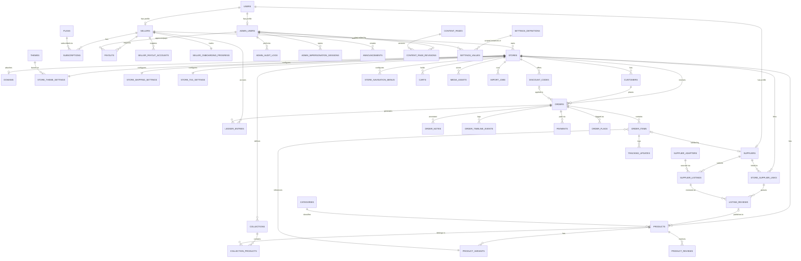

# goto5x.com — Database Schema (v1, updated for SRS v0.5)

PostgreSQL. All timestamps `timestamptz`. All primary keys `uuid` unless noted.
Companion to `docs/SRS.md` §3.2 (tenant isolation), §3.8 (Settings Registry), §5.6b
(payout/disbursement), §5.13–§5.23 (v0.5 commerce features), and §8 (entity list).

## Tenant strategy

- Every **directly** tenant-owned table carries `store_id`.
- Child tables that logically belong to a tenant row through a parent FK also get
  `store_id` denormalized onto them directly — the RLS policy is identical
  (`USING (store_id = current_setting('app.store_id')::uuid)`) everywhere, with no
  exceptions to reason about. New in v0.5: `customers`, `product_reviews`, `carts`,
  `collections`, `collection_products`, `store_navigation_menus`, `order_notes`,
  `order_timeline_events`, `import_jobs`, `store_tax_settings`, and (v1.1-ahead)
  `return_requests`, `store_content_pages`, `newsletter_subscribers` all follow this
  same rule — tenant isolation is not relaxed for "smaller" or "newer" tables.
- Global (platform-level, not tenant-owned) tables: `users`, `suppliers`,
  `supplier_listings`, `supplier_adapters`, `themes`, `plans`, `categories`,
  `admin_users`, `admin_audit_logs`, `admin_impersonation_sessions`,
  `settings_definitions`, `settings_values`, `announcements`, `content_pages`,
  `content_page_revisions`, `seller_payout_accounts`, `seller_onboarding_progress`
  (seller-scoped, not store-scoped — a seller may have multiple stores but one
  onboarding journey), and (v1.1-ahead) `support_tickets`, `support_ticket_messages`,
  `referral_links`, `referral_conversions`.
- `ledger_entries`, `payouts`, `seller_payout_accounts`, and
  `seller_onboarding_progress` are scoped by `seller_id`, not `store_id`, using the
  same "own-row-only" access rule as tenant RLS.

## Currency strategy

Unchanged from v0.4: `stores.currency` is the source of truth; historical/
transactional tables denormalize it at creation time (now including `orders.tax_amount`
and cart line items, which are computed in the store's currency); mutable
configuration tables read it via a live join. No v0.5 addition breaks this rule.

---

## Entity-relationship overview

Every module in the architecture reads its tunable behavior through
`SETTINGS_DEFINITIONS`/`SETTINGS_VALUES` — unchanged core principle. v0.5's new
modules (Customers, Reviews, Carts, Discovery/Merchandising, Manual Orders, Data
Portability, Receipts/Tax, Guard-Rails) all plug into the same hub rather than
inventing their own configuration mechanism.

---

## Table definitions — v0.4 tables (unchanged, summarized; full detail in prior version)

`users, sellers, stores, domains, themes, store_theme_settings,
store_shipping_settings, discount_codes, products, categories, product_variants,
media_assets, suppliers, supplier_adapters, store_supplier_links,
supplier_listings, listing_reviews, order_items, tracking_updates, payments,
ledger_entries, seller_payout_accounts, payouts, plans, subscriptions, admin_users,
admin_audit_logs, admin_impersonation_sessions, settings_definitions,
settings_values, order_flags, announcements, content_pages, content_page_revisions,
platform_metrics_snapshots` — all as defined in the v0.4 schema, with the following
column additions/changes for v0.5:

### `stores` — v0.5 additions
| Column | Type | Notes |
|---|---|---|
| status | enum(`active`,`suspended`,`banned`,`archived`) | **`archived` is new** — the end state of the dormant-store lifecycle (FR-23.2), distinct from `suspended`: storefront fully offline, data retained |
| access_mode | enum(`public`,`coming_soon`,`password_protected`) default `'public'` | new — FR-16.5 |
| access_password_hash | text nullable | new — set only when `access_mode = 'password_protected'` |
| last_active_at | timestamptz | new — updated on meaningful seller activity; the signal the dormant-store job (FR-23.2) checks |
| dormant_warning_sent_at | timestamptz nullable | new — prevents re-sending the warning email every job run |

### `products` — v0.5 additions
| Column | Type | Notes |
|---|---|---|
| average_rating | numeric(2,1) default 0 | new — denormalized from `product_reviews` for storefront page-load speed (FR-14.4); recomputed transactionally whenever a review's status changes |
| review_count | integer default 0 | new — same reasoning |
| search_vector | tsvector, generated | new — `GENERATED ALWAYS AS (to_tsvector('english', title \|\| ' ' \|\| description)) STORED`; powers FR-16.2 |

Index: `idx_products_search (search_vector)` GIN — storefront search (FR-16.2).

### `orders` — v0.5 additions
| Column | Type | Notes |
|---|---|---|
| customer_id | uuid FK → customers.id, nullable | new — set on checkout via the auto-match/create in FR-13.1 |
| source | enum(`storefront`,`manual`) default `'storefront'` | new — FR-17.1 |
| manual_payment_link_token | text nullable unique | new — set only for `source = 'manual'` orders using the payment-link path |
| tags | text[] default `'{}'` | new — FR-17.3, free-form seller labels |
| tax_amount | numeric(12,2) default 0 | new — computed from `store_tax_settings` at order time, itemized on the invoice (FR-19.3) |
| invoice_pdf_url | text nullable | new — MinIO URL of the generated PDF invoice (FR-19.1) |

Index: `idx_orders_customer (customer_id)`; `idx_orders_tags (tags)` GIN — order-tag filtering (FR-17.3); `idx_orders_manual_payment_link (manual_payment_link_token)` unique.

### `payments` — v0.5 addition
`gateway` enum extended: `('safepay','cod','payfast','jazzcash','easypaisa','stripe','manual')`
— `manual` is new, used for the "mark as paid directly" path on manual orders
(FR-17.1); it is not a customer-facing gateway and carries no
`gateway_transaction_id`.

---

## New tables — v0.5

### `customers` (tenant — FR-13.1–13.3)
| Column | Type | Notes |
|---|---|---|
| id | uuid PK | |
| store_id | uuid FK → stores.id | |
| email | text | |
| name | text nullable | |
| phone | text nullable | |
| orders_count | integer default 0 | incremented on each completed order from this email at this store |
| total_spent | numeric(12,2) default 0 | sum of completed order totals |
| first_order_at, last_order_at | timestamptz nullable | |
| created_at | timestamptz | |

Unique: `(store_id, email)` — same buyer email at two different stores is
**two separate rows**, by design (FR-13.3). Index: `idx_customers_store_email
(store_id, email)` (covered by the unique constraint); `idx_customers_store_spent
(store_id, total_spent desc)` for the "top customers" dashboard sort.

### `product_reviews` (tenant — FR-14.1–14.4)
| Column | Type | Notes |
|---|---|---|
| id | uuid PK | |
| store_id | uuid | denormalized for RLS |
| product_id | uuid FK → products.id | |
| order_id | uuid FK → orders.id, nullable | present only when the review is linked to a real purchase |
| buyer_name | text | |
| buyer_email | text | |
| rating | integer | 1–5, checked at the DB level |
| body | text | |
| is_verified_purchase | boolean | true only when `order_id` references a completed order containing this product at this store |
| status | enum(`pending`,`approved`,`hidden`) default `'pending'` | no auto-publish (FR-14.3) |
| created_at | timestamptz | |

Index: `idx_reviews_product_status (product_id, status)` — storefront display query;
`idx_reviews_store_status (store_id, status)` — seller moderation queue.

### `carts` (tenant — FR-15.1–15.2)
| Column | Type | Notes |
|---|---|---|
| id | uuid PK | |
| store_id | uuid FK → stores.id | |
| buyer_email | text nullable | null until captured; the row is only created once this is known (FR-15.1) |
| session_token | text unique | correlates a cart with the buyer's browser session |
| items | jsonb | line-item snapshot: `[{variant_id, quantity, unit_price}]` — a cart is ephemeral/pre-transactional, so a jsonb blob is pragmatic here, unlike `order_items` which needs full relational integrity |
| status | enum(`active`,`abandoned`,`converted`,`expired`) default `'active'` | |
| converted_order_id | uuid FK → orders.id, nullable | set when the cart becomes a real order |
| created_at, updated_at | timestamptz | |

Index: `idx_carts_store_status_updated (store_id, status, updated_at)` — the
abandoned-cart flagging job's scan (FR-15.2); `idx_carts_session_token
(session_token)` unique.

### `collections` (tenant — FR-16.1) and `collection_products` (join)
| Column | Type | Notes |
|---|---|---|
| id | uuid PK | |
| store_id | uuid FK → stores.id | |
| title | text | |
| slug | text | |
| description | text nullable | |
| is_active | boolean default true | |
| created_at | timestamptz | |

Unique: `(store_id, slug)`. `collection_products`: `collection_id` FK,
`product_id` FK, `sort_order` integer — unique `(collection_id, product_id)`,
index `idx_collection_products_collection (collection_id, sort_order)` for
ordered storefront rendering.

### `store_navigation_menus` (tenant — FR-16.3)
| Column | Type | Notes |
|---|---|---|
| id | uuid PK | |
| store_id | uuid FK → stores.id | |
| location | enum(`header`,`footer`) | |
| items | jsonb | ordered list: `[{label, type: collection\|content_page\|external, target_id, url}]` |
| updated_at | timestamptz | |

Unique: `(store_id, location)`.

### `order_notes` (tenant — FR-17.2)
| Column | Type | Notes |
|---|---|---|
| id | uuid PK | |
| store_id | uuid | denormalized for RLS |
| order_id | uuid FK → orders.id | |
| author_user_id | uuid FK → users.id | |
| body | text | |
| created_at | timestamptz | |

Index: `idx_order_notes_order (order_id)`. Never surfaced on any buyer-facing query
— enforced by simply never joining this table into a storefront/order-status
response, not by a field-level permission check.

### `order_timeline_events` (tenant, append-only — FR-17.4)
| Column | Type | Notes |
|---|---|---|
| id | uuid PK | |
| store_id | uuid | denormalized for RLS |
| order_id | uuid FK → orders.id | |
| event_type | text | e.g. `status_changed`, `note_added`, `edited`, `tracking_uploaded` |
| metadata | jsonb | event-specific detail (e.g. old/new status) |
| created_at | timestamptz | never updated — a full history, same immutability discipline as `admin_audit_logs` and `ledger_entries` |

Index: `idx_order_timeline_order_created (order_id, created_at)`.

### `import_jobs` (tenant — FR-18.1–18.2)
| Column | Type | Notes |
|---|---|---|
| id | uuid PK | |
| store_id | uuid FK → stores.id | |
| type | enum(`product_import`,`product_export`,`order_export`) | |
| status | enum(`pending`,`processing`,`completed`,`failed`) | |
| file_url | text | source CSV (import) or generated output (export), stored in MinIO |
| error_log | jsonb nullable | per-row errors for `product_import`, so a bad row doesn't fail the whole job (FR-18.2) |
| created_at, completed_at | timestamptz | |

Index: `idx_import_jobs_store_status (store_id, status)`.

### `store_tax_settings` (tenant, 1:1 with store — FR-19.3)
| Column | Type | Notes |
|---|---|---|
| id | uuid PK | |
| store_id | uuid FK → stores.id, unique | |
| tax_rate | numeric(5,2) default 0 | single rate per store — no multi-jurisdiction tables in v1.0 |
| tax_inclusive | boolean default true | whether displayed prices already include tax |
| tax_label | text default `'Tax'` | shown on the invoice line item |
| updated_at | timestamptz | |

### `seller_onboarding_progress` (global, seller-scoped — FR-20.1)
| Column | Type | Notes |
|---|---|---|
| id | uuid PK | |
| seller_id | uuid FK → sellers.id, unique | |
| template_selected | boolean default false | |
| logo_uploaded | boolean default false | |
| first_product_added | boolean default false | |
| domain_configured | boolean default false | |
| completed_at | timestamptz nullable | |
| updated_at | timestamptz | |

---

## v1.1-ahead tables (documented now so v1.0 doesn't need a migration to add them; not built in v1.0)

### `return_requests` (tenant — FR-22.3)
`id, store_id, order_id, buyer_reason, status (requested/approved/rejected/completed),
requested_at, resolved_at, resolved_by (FK admin_users, nullable)`. Completion
triggers the existing `refund_adjustment` ledger entry (FR-6.5) — no new ledger
mechanism.

### `store_content_pages` / `store_content_page_revisions` (tenant — FR-22.4)
Mirrors the platform-level `content_pages`/`content_page_revisions` pattern
exactly, just with a `store_id`, for tenant-owned SEO/blog pages.

### `support_tickets` / `support_ticket_messages` (global — FR-22.5)
`support_tickets`: `id, requester_type (seller/supplier), requester_id, subject,
status, priority, created_at`. `support_ticket_messages`: `id, ticket_id,
author_type (requester/admin), author_id, body, created_at`.

### `referral_links` / `referral_conversions` (global — FR-22.6)
`referral_links`: `id, seller_id, code (unique), created_at`.
`referral_conversions`: `id, referral_link_id, referred_seller_id, reward_status,
reward_amount, created_at`. Reward amount/trigger condition are Settings Registry
entries (`referral.reward_amount`, `referral.reward_trigger`), not hard-coded.

### `newsletter_subscribers` (tenant — FR-22.7)
`id, store_id, email, subscribed_at, is_active` — unique `(store_id, email)`,
exportable via the same CSV export mechanism as products/orders (FR-18.3).

---

## Settings Registry — new v0.5 keys (illustrative, not exhaustive)

`cart.abandoned_after_hours` (scope: global/store) · `lifecycle.dormant_warning_days`,
`lifecycle.dormant_suspend_days`, `lifecycle.dormant_archive_days` (scope: global,
free-plan stores) · `catalog.low_stock_threshold` (scope: plan/store) ·
`finance.monthly_infra_cost` (scope: global — admin-entered, FR-23.4) ·
`plans.free_store_limit_per_identity` (scope: global, FR-23.5) ·
`billing.yearly_discount_percent` (scope: plan, FR-7.6) ·
`billing.launch_campaign_expiry` / `billing.launch_campaign_seller_limit` (scope:
global/plan, FR-7.7) · `referral.reward_amount`, `referral.reward_trigger` (scope:
global, v1.1-ahead). All follow the same `settings_definitions`/`settings_values`
mechanism already in place — no new configuration system was introduced for any
v0.5 feature.

---

## Heavy-query index summary — v0.5 additions

| Query | Index |
|---|---|
| Storefront full-text search | `products (search_vector)` GIN |
| Customer list sorted by spend | `customers (store_id, total_spent desc)` |
| Review moderation queue | `product_reviews (store_id, status)` |
| Product page review display | `product_reviews (product_id, status)` |
| Abandoned-cart flagging job scan | `carts (store_id, status, updated_at)` |
| Ordered collection rendering | `collection_products (collection_id, sort_order)` |
| Order dashboard filtered by tag | `orders (tags)` GIN |
| Import/export job status polling | `import_jobs (store_id, status)` |
| Order timeline rendering | `order_timeline_events (order_id, created_at)` |

*(All v0.4 heavy-query indexes — order dashboard, buyer status lookup, supplier
multi-store dashboard, domain resolution, ledger/payout jobs, discount lookup,
settings resolution — are unchanged; see prior version.)*

## Extensibility deliberately not modeled yet

Multi-jurisdiction/tax-table complexity (one rate per store only, v1.0), full
multi-currency conversion, and anything in the v1.1-ahead/Phase-2+ lists above
beyond what's explicitly documented here are intentionally deferred — each is a new
table + FKs later, not a redesign, for the same reason as every prior deferral in
this document: tenancy, the ledger pattern, and the Settings Registry already
generalize to them.
