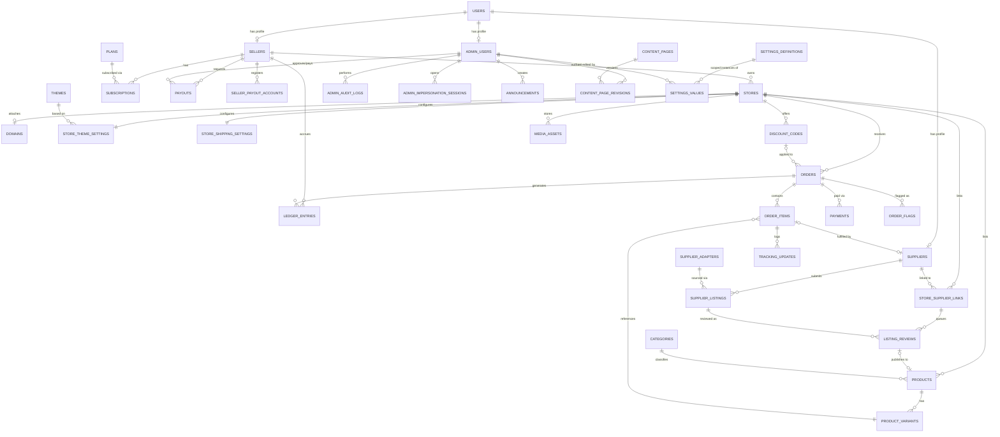

# goto5x.com — Database Schema (v1, updated for SRS v0.4)

PostgreSQL. All timestamps `timestamptz`. All primary keys `uuid` unless noted.
Companion to `docs/SRS.md` §3.2 (tenant isolation), §3.8 (Settings Registry), §5.6b
(payout/disbursement), and §8 (entity list).

## Tenant strategy

- Every **directly** tenant-owned table carries `store_id`.
- Child tables that logically belong to a tenant row through a parent FK
  (`order_items` → `orders`, `product_variants` → `products`,
  `tracking_updates` → `order_items`, `listing_reviews` → `store_supplier_links`,
  `order_flags` → `orders`) **also get `store_id` denormalized onto them directly.**
  This is a deliberate normalization trade-off: Postgres Row-Level Security (SRS §3.2)
  needs a direct column to filter on — a policy that requires joining up to a parent
  table to find `store_id` is slower and, more importantly, harder to prove correct
  for every query path. A flat `store_id` on every tenant row makes the RLS policy
  identical (`USING (store_id = current_setting('app.store_id')::uuid)`) everywhere,
  with no exceptions to reason about.
- Global (platform-level, not tenant-owned) tables: `users`, `suppliers`,
  `supplier_listings`, `supplier_adapters`, `themes`, `plans`, `categories`,
  `admin_users`, `admin_audit_logs`, `admin_impersonation_sessions`,
  `settings_definitions`, `settings_values`, `announcements`, `content_pages`,
  `content_page_revisions`, `seller_payout_accounts`.
- The earlier standalone `feature_flags` table is retired in favor of the generic
  **Settings Registry** (`settings_definitions` + `settings_values`, detailed below)
  — a feature flag is simply a boolean-typed, scoped setting, not a separate
  mechanism. This is the schema half of SRS §3.8/§5.8 (Admin Control Plane).
- `ledger_entries`, `payouts`, and `seller_payout_accounts` are scoped by `seller_id`,
  not `store_id` (a seller may own more than one store; payout accounting is
  per-seller, not per-store) — the same "own-row-only" access rule applies, enforced
  the same way as tenant RLS.

## Currency strategy (new in v0.4)

No table or piece of logic hard-codes `"PKR"`. The rule that determines whether a
table gets its own `currency` column:

- **Transactional/historical records** (`orders`, `payments`, `ledger_entries`,
  `payouts`) **denormalize `currency`** at the moment they're created, copied from
  the store's (or, for `ledger_entries`/`payouts`, the seller's primary store's)
  configured currency. These rows must never silently change value even if the
  store's currency setting changes later — the same immutability reasoning as the
  append-only ledger itself.
- **Mutable, live configuration** (`product_variants`, `discount_codes`,
  `store_shipping_settings`) does **not** get its own currency column — it's always
  read through a live join to `stores.currency`, which is safe precisely because
  this data isn't historical; if a store's currency setting changes, its live prices
  should reflect that immediately.
- **Platform-level pricing** not tied to any single store (`plans`) gets its own
  explicit `currency` column, since there's no store to join to.
- `stores.currency` (default `'PKR'`) is the single source of truth per store. Every
  other currency reference in the schema either denormalizes from it (historical) or
  joins to it (live) — nothing else is a hard-coded assumption.

At launch every store's currency is PKR; this schema costs nothing extra today and
avoids a currency-migration project the day international expansion (SRS §10, Phase 4)
actually happens.

---

## Entity-relationship overview

Every module in the architecture (Catalog, Orders, Payments/Ledger, Payouts,
Suppliers, Theme Engine) reads its tunable behavior through
`SETTINGS_DEFINITIONS`/`SETTINGS_VALUES` — this pair is the schema backbone of the
Admin Control Plane (SRS §3.8, §5.8) and is intentionally drawn as a hub rather than
tucked away as "just another table."

---

## Table definitions

### `users` (global — shared identity, SSO hook per SRS §3.2a)
| Column | Type | Notes |
|---|---|---|
| id | uuid PK | |
| email | text unique | |
| phone | text nullable | |
| password_hash | text nullable | null if OAuth-only |
| role_flags | text[] | e.g. `{seller}`, `{supplier,seller}` — one user can hold multiple role profiles |
| mfa_enabled | boolean default false | mandatory `true` enforced at app layer for `admin_users` (FR-8.12) |
| email_verified_at | timestamptz nullable | |
| created_at, updated_at | timestamptz | |

### `sellers` (global profile, owns tenant stores)
| Column | Type | Notes |
|---|---|---|
| id | uuid PK | |
| user_id | uuid FK → users.id, unique | |
| business_name | text | |
| kyc_status | enum(`unverified`,`pending`,`verified`) | drives hold graduation (FR-6.3) and payout risk summary (FR-6.9) |
| kyc_verified_at | timestamptz nullable | |
| created_at, updated_at | timestamptz | |

### `stores` (tenant root)
| Column | Type | Notes |
|---|---|---|
| id | uuid PK | this **is** the `store_id` referenced everywhere |
| seller_id | uuid FK → sellers.id | |
| name | text | |
| slug | text unique | subdomain: `slug.goto5x.com` |
| status | enum(`active`,`suspended`,`banned`) | drives FR-5.3 buyer-facing behavior |
| currency | text default `'PKR'` | single source of truth for this store's currency (Currency Strategy, above) |
| created_at, updated_at | timestamptz | |

Index: `idx_stores_seller_id (seller_id)`.

### `domains`
| Column | Type | Notes |
|---|---|---|
| id | uuid PK | |
| store_id | uuid FK → stores.id | |
| domain_name | text unique | **unique index is the hot path** — every inbound request resolves its tenant by looking up the request hostname here first |
| verification_status | enum(`pending`,`verified`,`failed`) | |
| tls_status | enum(`pending`,`issued`,`error`) | |
| verified_at | timestamptz nullable | |

Index: `idx_domains_domain_name (domain_name)` unique — critical for per-request tenant resolution latency.

### `themes` (global template catalog)
| Column | Type | Notes |
|---|---|---|
| id | uuid PK | |
| name | text | |
| tier | enum(`free`,`premium`) | |
| preview_image_url | text | |
| version | text | |
| is_active | boolean | retired themes stay for existing stores but drop from selection (FR-8.6) |

### `store_theme_settings` (tenant, 1:1 with store)
| Column | Type | Notes |
|---|---|---|
| id | uuid PK | |
| store_id | uuid FK → stores.id, unique | |
| theme_id | uuid FK → themes.id | |
| settings | jsonb | colors, fonts, logo/banner images, section layout — v1.0 customizer scope (FR-1.2) |
| custom_code | text nullable | coded-theme escape hatch (FR-1.6, Phase 2), gated by plan at the app layer |
| updated_at | timestamptz | |

### `store_shipping_settings` (tenant, 1:1 with store — new in v0.4, FR-2.10)
| Column | Type | Notes |
|---|---|---|
| id | uuid PK | |
| store_id | uuid FK → stores.id, unique | |
| flat_rate | numeric(12,2) | applies to self-fulfilled items only (FR-5.6); supplier items use their adapter's rate |
| free_shipping_threshold | numeric(12,2) nullable | order subtotal above which shipping is waived; null = no free-shipping tier |
| updated_at | timestamptz | |

Deliberately simple for v1.0 — no zones, no weight tiers (Phase 2, SRS §10). No
`currency` column: always read via a live join to `stores.currency` (Currency
Strategy, above), since this is mutable seller config, not a historical record.

### `discount_codes` (tenant — new in v0.4, FR-2.11/FR-5.5)
| Column | Type | Notes |
|---|---|---|
| id | uuid PK | |
| store_id | uuid FK → stores.id | |
| code | text | e.g. `SUMMER10` |
| type | enum(`percentage`,`fixed_amount`) | |
| value | numeric(12,2) | percentage (0–100) or a fixed amount in the store's currency |
| expires_at | timestamptz nullable | null = never expires |
| usage_limit | integer nullable | null = unlimited |
| usage_count | integer default 0 | incremented atomically on each successful application, never decremented |
| is_active | boolean default true | manual kill-switch independent of expiry/usage-limit |
| created_at | timestamptz | |

Unique: `(store_id, code)` — a code is unique within a store, not platform-wide.
Advanced discount types (auto-apply, BOGO, scheduled sales) are Phase 2 (SRS §10);
this table intentionally only models the basic case.

### `products` (tenant)
| Column | Type | Notes |
|---|---|---|
| id | uuid PK | |
| store_id | uuid FK → stores.id | |
| category_id | uuid FK → categories.id, nullable | drives category-level commission overrides (FR-6.1/FR-8.3) and storefront browsing |
| title | text | |
| description | text | |
| status | enum(`draft`,`active`,`archived`) | |
| source_type | enum(`self`,`supplier`) | determines whether FR-2.10 (shipping settings) or FR-4.6 (supplier rate) applies at checkout |
| created_at, updated_at | timestamptz | |

Index: `idx_products_store_status (store_id, status)` — storefront catalog browsing, the highest-QPS read in the system.

### `categories` (global — admin-managed taxonomy)
| Column | Type | Notes |
|---|---|---|
| id | uuid PK | |
| name | text | e.g. "Electronics", "Fashion", "Home" |
| slug | text unique | |
| created_at | timestamptz | |

Admin-managed (part of the Control Plane, SRS FR-8.3) specifically so commission can
be tuned per category via the Settings Registry without a schema change per category.

### `product_variants` (tenant, child of products)
| Column | Type | Notes |
|---|---|---|
| id | uuid PK | |
| store_id | uuid | denormalized for RLS |
| product_id | uuid FK → products.id | |
| sku | text | |
| price | numeric(12,2) | read via a live join to `stores.currency` — no own currency column (Currency Strategy) |
| compare_at_price | numeric(12,2) nullable | |
| stock_quantity | integer | for supplier-sourced variants, mirrors the shared supplier stock figure (FR-4.5) |
| attributes | jsonb | size/color/etc. |

Index: `idx_variants_product_id (product_id)`.

### `media_assets` (tenant)
| Column | Type | Notes |
|---|---|---|
| id | uuid PK | |
| store_id | uuid FK → stores.id | |
| product_id | uuid FK → products.id, nullable | |
| url | text | **self-hosted MinIO** (S3-compatible) URL fronted by the Cloudflare CDN, not a Drive URL (FR-9.2, SRS §3.3) |
| source | enum(`upload`,`google_drive_import`) | |
| type | enum(`image`,`video`) | |
| created_at | timestamptz | |

Index: `idx_media_store_id (store_id)`, `idx_media_product_id (product_id)`.

### `suppliers` (global profile)
| Column | Type | Notes |
|---|---|---|
| id | uuid PK | |
| user_id | uuid FK → users.id, unique | |
| business_name | text | |
| verification_status | enum(`pending`,`verified`,`rejected`) | |
| created_at | timestamptz | |

### `supplier_adapters` (global registry — new in v0.4, FR-4.9)
| Column | Type | Notes |
|---|---|---|
| id | uuid PK | |
| adapter_type | text unique | matches `supplier_listings.adapter_type`, e.g. `printify`, `cj_dropshipping` |
| display_name | text | shown in the admin UI |
| is_enabled | boolean default true | admin can flip this to stop new syncs/order-forwarding through the adapter without a deploy — existing orders are unaffected |
| config | jsonb | non-secret adapter configuration only; API keys/credentials live in the encrypted secrets store (SRS §6.5), never here |
| created_at, updated_at | timestamptz | |

This is the schema half of the admin adapter registry (§3.5, FR-4.9) — the same
pattern will host Payment Adapter and Disbursement Adapter registrations as those
gain more than one implementation (v1.0 has exactly one of each, so a full registry
UI for them is not built until Phase 1.x proves it's needed).

### `store_supplier_links` (join table — the core of the multi-store supplier dashboard)
| Column | Type | Notes |
|---|---|---|
| id | uuid PK | |
| store_id | uuid FK → stores.id | |
| supplier_id | uuid FK → suppliers.id | |
| status | enum(`pending_seller_review`,`active`,`revoked`) | |
| invited_by | enum(`seller`,`supplier`) | supports FR-2.6 seller-initiated invite AND supplier self-registration |
| approved_at | timestamptz nullable | |
| created_at | timestamptz | |

Unique: `(store_id, supplier_id)`. Index: `idx_ssl_supplier_status (supplier_id, status)` — **this is the query behind the supplier's multi-store dashboard** (FR-3.3): "all stores I'm actively linked to."

### `supplier_listings` (global — a supplier's catalog, adapter-sourced per SRS §3.5)
| Column | Type | Notes |
|---|---|---|
| id | uuid PK | |
| supplier_id | uuid FK → suppliers.id | |
| adapter_type | text FK → supplier_adapters.adapter_type | extend via the registry, never branch core code (§3.5) |
| external_product_id | text | supplier-side ID |
| title | text | |
| price | numeric(12,2) | re-validated against at checkout (FR-4.8) — never trust a cached storefront price |
| stock_quantity | integer | the shared figure FR-4.5 decrements against |
| shipping_cost | numeric(12,2) | shown to buyer (FR-4.6) |
| estimated_delivery_min_days | integer | shown to buyer (FR-4.6) |
| estimated_delivery_max_days | integer | shown to buyer (FR-4.6) |
| supported_countries | text[] | ISO country codes this supplier can deliver to — checkout blocks against this (FR-4.7) |
| raw_payload | jsonb | adapter-specific data, kept for debugging/resync |
| updated_at | timestamptz | last successful sync (FR-4.3) |

### `listing_reviews` (tenant via link, the seller approval queue)
| Column | Type | Notes |
|---|---|---|
| id | uuid PK | |
| store_id | uuid | denormalized for RLS |
| store_supplier_link_id | uuid FK → store_supplier_links.id | |
| supplier_listing_id | uuid FK → supplier_listings.id | |
| status | enum(`pending`,`approved`,`rejected`) | no auto-publish path (FR-2.7) |
| reviewed_by | uuid FK → users.id, nullable | |
| reviewed_at | timestamptz nullable | |
| product_id | uuid FK → products.id, nullable | set once approved and published into the store's catalog |

Index: `idx_listing_reviews_link_status (store_supplier_link_id, status)`.

### `orders` (tenant)
| Column | Type | Notes |
|---|---|---|
| id | uuid PK | |
| store_id | uuid FK → stores.id | |
| buyer_id | uuid FK → users.id, nullable | null for guest checkout |
| buyer_email | text | |
| status_lookup_token | text unique | signed, unguessable token for the buyer order-status link (FR-5.4) — never the row's own `id` |
| shipping_address | jsonb | includes the shipping country checked against `supplier_listings.supported_countries` (FR-4.7) |
| status | enum(`pending`,`confirmed`,`shipped`,`delivered`,`completed`,`cancelled`,`disputed`) | |
| discount_code_id | uuid FK → discount_codes.id, nullable | |
| discount_amount | numeric(12,2) default 0 | subtracted before commission is calculated (FR-6.1) |
| shipping_amount | numeric(12,2) | sum of per-fulfillment-source shipping (FR-5.6) |
| total_amount | numeric(12,2) | |
| currency | text | denormalized from `stores.currency` at order creation (Currency Strategy) — never changes retroactively |
| placed_at | timestamptz | |

Index: `idx_orders_store_status_date (store_id, status, placed_at desc)` — the seller order dashboard's primary query (filter by status, sort by date). Index: `idx_orders_status_lookup_token (status_lookup_token)` unique — the buyer order-status page's only lookup path.

### `order_items` (tenant, child of orders)
| Column | Type | Notes |
|---|---|---|
| id | uuid PK | |
| store_id | uuid | denormalized for RLS |
| order_id | uuid FK → orders.id | |
| product_id | uuid FK → products.id | |
| variant_id | uuid FK → product_variants.id | |
| supplier_id | uuid FK → suppliers.id, nullable | null if self-fulfilled |
| quantity | integer | |
| unit_price | numeric(12,2) | |
| shipping_cost | numeric(12,2) | copied from `store_shipping_settings` (self-fulfilled) or `supplier_listings.shipping_cost` (supplier-fulfilled) at order time — a per-line-item historical snapshot, same reasoning as `orders.currency` |
| fulfillment_status | enum(`pending`,`confirmed`,`shipped`,`delivered`,`completed`) | the literal per-order checklist, FR-3.4 |

Index: `idx_order_items_supplier_status (supplier_id, fulfillment_status, created_at)` — **the query behind the supplier's multi-store order tracking view**: every order-item across every linked store, filterable by status. Index: `idx_order_items_order_id (order_id)`.

### `tracking_updates`
| Column | Type | Notes |
|---|---|---|
| id | uuid PK | |
| order_item_id | uuid FK → order_items.id | |
| tracking_id | text | |
| carrier | text nullable | |
| uploaded_by | uuid FK → users.id | supplier's user id |
| uploaded_at | timestamptz | |

Index: `idx_tracking_order_item (order_item_id)`.

### `payments`
| Column | Type | Notes |
|---|---|---|
| id | uuid PK | |
| store_id | uuid | denormalized for RLS |
| order_id | uuid FK → orders.id | |
| gateway | enum(`safepay`,`cod`,`payfast`,`jazzcash`,`easypaisa`,`stripe`) | mirrors the Payment Adapter interface (SRS §3.5); `cod` exists in the schema now but is gated off for every seller by `payments.cod_enabled` at launch (SRS §5.6a) |
| gateway_transaction_id | text nullable unique | null for COD (when it is eventually enabled) |
| amount | numeric(12,2) | |
| currency | text | denormalized from `orders.currency` at payment time (Currency Strategy) |
| status | enum(`pending`,`succeeded`,`failed`,`refunded`) | |
| raw_webhook_payload | jsonb nullable | only ever written after signature verification (SRS §6.5) |
| created_at | timestamptz | |

Index: `idx_payments_gateway_txn (gateway_transaction_id)` unique — idempotent webhook handling.

### `ledger_entries` (append-only — single source of truth for balances, seller-scoped)
| Column | Type | Notes |
|---|---|---|
| id | uuid PK | |
| seller_id | uuid FK → sellers.id | |
| order_id | uuid FK → orders.id, nullable | |
| type | enum(`sale_credit`,`commission_debit`,`gateway_fee_debit`,`hold_release`,`reserve_hold`,`reserve_release`,`payout_debit`,`refund_adjustment`) | `reserve_hold`/`reserve_release` are new in v0.4 (FR-6.13) |
| amount | numeric(12,2) | signed (+/-) |
| currency | text | denormalized at entry-creation time from the originating order/store (Currency Strategy) |
| balance_bucket | enum(`pending`,`available`,`reserved`) | `reserved` is new in v0.4 — holds the rolling-reserve portion separately from the ordinary hold |
| hold_release_at | timestamptz nullable | set on `sale_credit` rows for the hold-release scheduled job (FR-6.2) |
| reserve_release_at | timestamptz nullable | set on `reserve_hold` rows for the reserve-release scheduled job (FR-6.13); additive to, and independent of, `hold_release_at` |
| created_at | timestamptz | never updated — corrections are new offsetting rows, never edits |

Index: `idx_ledger_seller_created (seller_id, created_at)` — balance computation.
Partial indexes:
`idx_ledger_pending_release ON ledger_entries (hold_release_at) WHERE balance_bucket = 'pending'`
and `idx_ledger_reserve_release ON ledger_entries (reserve_release_at) WHERE type = 'reserve_hold'`
— these are the queries the hold-release and reserve-release scheduled jobs run every
cycle: "which entries are past their release time," and neither may scan the whole
table to find out.

### `seller_payout_accounts` (global, seller-scoped — new in v0.4)
| Column | Type | Notes |
|---|---|---|
| id | uuid PK | |
| seller_id | uuid FK → sellers.id | |
| account_type | enum(`bank`,`raast`) | |
| account_title | text | payee name shown on the admin batch screen (FR-6.11) |
| account_number | text | IBAN or Raast ID |
| bank_name | text nullable | |
| is_primary | boolean default false | the account snapshotted onto a new payout request by default |
| created_at | timestamptz | |

Index: `idx_payout_accounts_seller (seller_id)`.

### `payouts` (seller-scoped — extended in v0.4 for the full request/approval/disbursement lifecycle)
| Column | Type | Notes |
|---|---|---|
| id | uuid PK | |
| seller_id | uuid FK → sellers.id | |
| amount | numeric(12,2) | must not exceed `available_balance` at request time (FR-6.7) |
| currency | text | denormalized at request time (Currency Strategy) |
| status | enum(`requested`,`approved`,`processing`,`paid`,`rejected`) | the full lifecycle visible to the seller (FR-6.12) |
| requested_via | enum(`manual`,`scheduled`) | `scheduled` set when generated by the FR-6.8 scheduled-payout job |
| risk_summary | jsonb | snapshot at request time: KYC status, dispute/refund rate, flagged-order count, account age, velocity signal (FR-6.9) — a snapshot, not a live join, so the approval queue shows what was true when it mattered, even if the seller's standing changes afterward |
| payout_account_snapshot | jsonb | copied from `seller_payout_accounts` at request time (FR-6.11) — the same immutability reasoning as `orders.currency`: if the seller edits their bank details later, an already-approved payout still pays out to the account that was on file when it was approved |
| disbursement_adapter_type | enum(`manual`,`api`) default `'manual'` | v1.0 always `manual`; Phase 1.x adds `api` (§3.5) |
| rejected_reason | text nullable | required when `status = 'rejected'` |
| approved_by | uuid FK → admin_users.id, nullable | |
| paid_by | uuid FK → admin_users.id, nullable | |
| requested_at | timestamptz | |
| approved_at, paid_at | timestamptz nullable | |

Index: `idx_payouts_seller_status (seller_id, status)`. Index:
`idx_payouts_approval_queue (status, requested_at)` — the admin approval queue's
primary query (FR-6.9), listing pending requests oldest-first.

### `plans` (global)
| Column | Type | Notes |
|---|---|---|
| id | uuid PK | |
| name | text | Starter / Growth / Premium |
| price | numeric(12,2) | renamed from `price_pkr` in v0.4 — see Currency Strategy |
| currency | text default `'PKR'` | plans aren't store-scoped, so — unlike most tables — they need their own explicit currency column |
| billing_interval | enum(`monthly`,`yearly`) | |
| is_active | boolean | retiring a plan doesn't delete it — existing subscribers stay on it |
| sort_order | integer | display order in the pricing/admin UI |

Commission-rate overrides, product/storage/template limits, and coded-theme access
for a plan are **not** columns on this table — they are `settings_values` rows scoped
to `('plan', plans.id)` (see Settings Registry below). This keeps adding a new
plan-gated capability a matter of registering one more setting key, not a migration.

### `subscriptions`
| Column | Type | Notes |
|---|---|---|
| id | uuid PK | |
| seller_id | uuid FK → sellers.id | |
| plan_id | uuid FK → plans.id | |
| status | enum(`active`,`past_due`,`cancelled`) | |
| current_period_end | timestamptz | |

Index: `idx_subscriptions_seller (seller_id)`.

### `admin_users` (global)
| Column | Type | Notes |
|---|---|---|
| id | uuid PK | |
| user_id | uuid FK → users.id, unique | |
| role | enum(`super_admin`,`support`) | `support` sub-role reserved for Phase 3 (§4 of SRS) |
| mfa_enabled | boolean | must be `true` — enforced at signup, not just a settable flag (FR-8.12) |

### `admin_audit_logs` (global, immutable — every Control Plane action)
| Column | Type | Notes |
|---|---|---|
| id | uuid PK | |
| admin_user_id | uuid FK → admin_users.id | |
| impersonation_session_id | uuid FK → admin_impersonation_sessions.id, nullable | set when the action happened while impersonating a seller/supplier (FR-8.4) |
| action | text | e.g. `seller.suspend`, `settings.update`, `payout.approve`, `payout.freeze`, `template.publish`, `content_page.update` |
| target_type | text | e.g. `store`, `seller`, `plan`, `settings_value`, `order`, `payout`, `content_page` |
| target_id | uuid | |
| before_value | jsonb nullable | prior state, required for any mutation |
| after_value | jsonb nullable | new state |
| created_at | timestamptz | |

Index: `idx_audit_admin_created (admin_user_id, created_at)`, `idx_audit_target (target_type, target_id)`, `idx_audit_impersonation (impersonation_session_id)`.
**Immutability is a DB-level grant, not an app convention:** the application's
runtime role has `INSERT` only on this table — no `UPDATE`/`DELETE` privilege exists,
so no application bug or compromised admin session can rewrite history (FR-8.9).

### `admin_impersonation_sessions` (global)
| Column | Type | Notes |
|---|---|---|
| id | uuid PK | |
| admin_user_id | uuid FK → admin_users.id | |
| target_type | enum(`seller`,`supplier`) | |
| target_id | uuid | |
| reason | text, required | admin must state why before the session opens |
| ip_address | inet | |
| started_at | timestamptz | |
| ended_at | timestamptz nullable | null while the impersonation session is live |

Index: `idx_impersonation_admin (admin_user_id, started_at)`, `idx_impersonation_target (target_type, target_id)`.
Every action taken during an open session is tagged with `impersonation_session_id`
in `admin_audit_logs`, so "what did admin X do while impersonating seller Y" is a
direct, indexed query, not a forensic reconstruction.

### `settings_definitions` (global — the Settings Registry catalog)
| Column | Type | Notes |
|---|---|---|
| key | text PK | e.g. `billing.commission_rate`, `payouts.hold_days`, `payouts.reserve_percentage`, `payouts.scheduled_mode_enabled`, `payouts.scheduled_day_of_month`, `payouts.frozen`, `payments.cod_enabled`, `catalog.product_limit`, `theme.coded_mode_enabled`, `platform.maintenance_mode` |
| value_type | enum(`boolean`,`number`,`string`,`json`) | |
| allowed_scopes | text[] | subset of `{global, plan, seller, category, store}` — enforced at write time |
| default_value | jsonb | used when no `settings_values` row exists for a given scope |
| validation | jsonb nullable | e.g. `{"min":0,"max":100}` for a percentage — rejected before it reaches `settings_values` (SRS §12, Risk 11) |
| description | text | shown in the admin UI |

### `settings_values` (global — the actual configuration data every module reads)
| Column | Type | Notes |
|---|---|---|
| id | uuid PK | |
| definition_key | text FK → settings_definitions.key | |
| scope_type | enum(`global`,`plan`,`seller`,`category`,`store`) | |
| scope_id | uuid nullable | null only when `scope_type = 'global'` |
| value | jsonb | |
| updated_by | uuid FK → admin_users.id | |
| updated_at | timestamptz | |

Unique: `(definition_key, scope_type, scope_id)` — this is also the point-lookup index
the resolver (`SettingsService.resolve`, SRS §3.8) uses: for a given key it checks
`seller` scope, then `plan` scope, then `category`/`store` where relevant, then
`global`, each a single indexed lookup, cached in Redis so most reads never hit
Postgres at all. Every write here produces a matching `admin_audit_logs` row.

### `order_flags` (tenant — risk/fraud review queue, FR-8.8)
| Column | Type | Notes |
|---|---|---|
| id | uuid PK | |
| store_id | uuid | denormalized for RLS |
| order_id | uuid FK → orders.id | |
| flagged_by | uuid FK → admin_users.id | |
| reason | text | |
| status | enum(`open`,`resolved`) | |
| created_at | timestamptz | |
| resolved_at | timestamptz nullable | |

Index: `idx_order_flags_status (status, created_at)` — the admin review queue's primary query.

### `announcements` (global, FR-8.7)
| Column | Type | Notes |
|---|---|---|
| id | uuid PK | |
| message | text | |
| level | enum(`info`,`warning`,`critical`) | |
| starts_at, ends_at | timestamptz | scheduling window |
| is_active | boolean | manual kill-switch independent of the schedule |
| created_by | uuid FK → admin_users.id | |
| created_at | timestamptz | |

Note: platform-wide **maintenance mode** itself is a `settings_values` row
(`platform.maintenance_mode`, scope `global`), not a row in this table — it is a
single on/off state with an allowlist, not a schedulable list of messages, so it
reuses the registry directly rather than adding a table for one boolean (SRS §5.8,
FR-8.7).

### `content_pages` (global — new in v0.4, FR-12.1)
| Column | Type | Notes |
|---|---|---|
| id | uuid PK | |
| slug | text unique | e.g. `terms-of-service`, `privacy-policy`, `refund-policy`, `about`, `contact` |
| title | text | |
| current_version | integer | points at the live version in `content_page_revisions` |
| updated_by | uuid FK → admin_users.id | |
| updated_at | timestamptz | |

### `content_page_revisions` (global, append-only — new in v0.4, FR-12.1)
| Column | Type | Notes |
|---|---|---|
| id | uuid PK | |
| content_page_id | uuid FK → content_pages.id | |
| version | integer | |
| body | text | rich-text/HTML content |
| updated_by | uuid FK → admin_users.id | |
| created_at | timestamptz | never updated — a new edit is a new row, never an edit to an old one, so "what did the Terms of Service say on date X" is always answerable |

Unique: `(content_page_id, version)`.

### `platform_metrics_snapshots` (global — Phase 1.1+ optimization, not required for v1.0)
| Column | Type | Notes |
|---|---|---|
| id | uuid PK | |
| snapshot_at | timestamptz | |
| gmv | numeric(14,2) | |
| revenue | numeric(14,2) | |
| commission_earned | numeric(14,2) | |
| active_store_count | integer | |
| metadata | jsonb | top-sellers list, etc. |

At v1.0 launch volume, FR-8.10's analytics are answered with live `SUM`/`COUNT`
queries against `orders`/`ledger_entries`/`stores` — this table only gets populated
by a scheduled job once that live aggregation is measurably slow, so it costs nothing
until it earns its keep (see `docs/mvp-v1-cutlist.md`).

---

## Heavy-query index summary (why each exists)

| Query | Index |
|---|---|
| Seller order dashboard (filter by status, sort by date) | `orders (store_id, status, placed_at desc)` |
| Buyer order-status lookup (no account) | `orders (status_lookup_token)` unique |
| Supplier multi-store dashboard (all order-items across linked stores) | `order_items (supplier_id, fulfillment_status, created_at)` |
| Supplier's list of linked stores | `store_supplier_links (supplier_id, status)` |
| Storefront catalog browsing | `products (store_id, status)` |
| Tenant resolution by custom domain (every request) | `domains (domain_name)` unique |
| Balance computation + hold-release job | `ledger_entries (seller_id, created_at)` + partial `ledger_entries (hold_release_at) WHERE balance_bucket='pending'` |
| Rolling-reserve release job | partial `ledger_entries (reserve_release_at) WHERE type='reserve_hold'` |
| Payout admin approval queue | `payouts (status, requested_at)` |
| Seller's registered payout accounts | `seller_payout_accounts (seller_id)` |
| Idempotent payment webhook handling | `payments (gateway_transaction_id)` unique |
| Listing approval queue | `listing_reviews (store_supplier_link_id, status)` |
| Discount code lookup at checkout | `discount_codes (store_id, code)` unique |
| Settings resolution (every module, every request path) | `settings_values (definition_key, scope_type, scope_id)` unique — cached in Redis, so this index mostly protects cache-miss/cold-start reads |
| Admin review queues (risk flags, listing approvals) | `order_flags (status, created_at)` |
| "What did admin X do while impersonating seller Y" | `admin_audit_logs (impersonation_session_id)` |

## Extensibility deliberately not modeled yet

Product reviews and full multi-currency conversion (buyer pays in a currency
different from the store's) are not in the v1 schema because they are not in the
SRS's functional requirements. Discount codes and per-store currency **are** now
modeled (v0.4) precisely because they were closed decisions, not because everything
imaginable should be pre-built — adding what's still missing later is a new table +
FKs, not a redesign, because tenancy (`store_id`), the ledger pattern, and the
Currency Strategy above already generalize to them.
