# goto5x.com — Database Schema (v1, updated for SRS v0.10)

PostgreSQL. All timestamps `timestamptz`. All primary keys `uuid` unless noted.
Companion to `docs/SRS.md` §3.2 (tenant isolation), §3.8 (Settings Registry), §5.6b
(payout/disbursement), §5.13–§5.23 (v0.5 commerce features), §5.24 (v0.6 external-
SaaS hooks), and §8 (entity list).

**Note on this revision:** v0.5 of this document summarized all v0.4 table
definitions to a bare table-name list ("unchanged, see prior version"). That was a
regression — this is the living schema reference and no table's column definitions
may exist only in git history. **Every v0.4 table's full column definition is
restored below**, alongside the v0.5, v0.6, and v0.7 additions. **v0.7 also closes
a genuine gap found while planning Module 2:** FR-9.1 (Google Drive import)
specified an OAuth connection with no table ever defined to store its tokens —
`google_drive_connections` (below) closes that gap, flagged and resolved with the
founder before any Module 2 code was written, not improvised silently.

## Tenant strategy

- Every **directly** tenant-owned table carries `store_id`.
- Child tables that logically belong to a tenant row through a parent FK also get
  `store_id` denormalized onto them directly — the RLS policy is identical
  (`USING (store_id = current_setting('app.store_id')::uuid)`) everywhere, with no
  exceptions to reason about. This applies uniformly to every tenant table, old and
  new: `store_theme_settings, store_shipping_settings, store_tax_settings,
  discount_codes, product_variants, media_assets, listing_reviews, order_items,
  order_flags, customers, product_reviews, carts, collections, collection_products,
  store_navigation_menus, order_notes, order_timeline_events, import_jobs`, and
  (v1.1-ahead) `return_requests, store_content_pages, newsletter_subscribers`.
- Global (platform-level, not tenant-owned) tables: `users`, `suppliers`,
  `supplier_listings`, `supplier_adapters`, `themes`, `plans`, `categories`,
  `admin_users`, `admin_audit_logs`, `admin_impersonation_sessions`,
  `settings_definitions`, `settings_values`, `announcements`, `content_pages`,
  `content_page_revisions`, `seller_payout_accounts`, `seller_onboarding_progress`,
  `template_entitlements`, `external_api_clients`, `seller_api_tokens` (new in
  v0.6), and (v1.1-ahead) `support_tickets`, `support_ticket_messages`,
  `referral_links`, `referral_conversions`.
- `ledger_entries`, `payouts`, `seller_payout_accounts`, `seller_onboarding_progress`,
  and `template_entitlements`/`seller_api_tokens` are scoped by `seller_id`, not
  `store_id`, using the same "own-row-only" access rule as tenant RLS.

## Currency strategy

`stores.currency` (default `'PKR'`) is the single source of truth per store.
**Transactional/historical records** (`orders`, `payments`, `ledger_entries`,
`payouts`) denormalize `currency` at creation time, copied from the store's (or
seller's primary store's) configured currency — these rows must never silently
change value even if the store's currency setting changes later. **Mutable, live
configuration** (`product_variants`, `discount_codes`, `store_shipping_settings`,
`store_tax_settings`) does **not** get its own currency column — it's read through
a live join to `stores.currency`, safe because it isn't historical. **Platform-level
pricing** not tied to any single store (`plans`) gets its own explicit `currency`
column, since there's no store to join to. At launch every store's currency is PKR;
this schema costs nothing extra today and avoids a currency-migration project when
international expansion happens.

---

## Entity-relationship overview

```mermaid
erDiagram
    USERS ||--o| SELLERS : "has profile"
    USERS ||--o| SUPPLIERS : "has profile"
    USERS ||--o| ADMIN_USERS : "has profile"
    SELLERS ||--o{ STORES : owns
    SELLERS ||--o{ SUBSCRIPTIONS : has
    SELLERS ||--o{ LEDGER_ENTRIES : accrues
    SELLERS ||--o{ PAYOUTS : requests
    SELLERS ||--o{ SELLER_PAYOUT_ACCOUNTS : registers
    SELLERS ||--|| SELLER_ONBOARDING_PROGRESS : tracks
    SELLERS ||--o{ TEMPLATE_ENTITLEMENTS : holds
    SELLERS ||--o{ SELLER_API_TOKENS : issues
    PLANS ||--o{ SUBSCRIPTIONS : "subscribed via"
    THEMES ||--o{ TEMPLATE_ENTITLEMENTS : "entitled via"
    EXTERNAL_API_CLIENTS ||--o{ SELLER_API_TOKENS : authorizes
    STORES ||--o| DOMAINS : "attaches"
    STORES ||--o{ PLATFORM_EVENTS : generates
    STORES ||--|| STORE_THEME_SETTINGS : configures
    STORES ||--|| STORE_SHIPPING_SETTINGS : configures
    STORES ||--|| STORE_TAX_SETTINGS : configures
    STORES ||--o{ DISCOUNT_CODES : offers
    STORES ||--o{ CUSTOMERS : has
    STORES ||--o{ COLLECTIONS : defines
    COLLECTIONS ||--o{ COLLECTION_PRODUCTS : contains
    PRODUCTS ||--o{ COLLECTION_PRODUCTS : "belongs to"
    STORES ||--o{ STORE_NAVIGATION_MENUS : configures
    STORES ||--o{ CARTS : holds
    THEMES ||--o{ STORE_THEME_SETTINGS : "based on"
    STORES ||--o{ PRODUCTS : lists
    PRODUCTS ||--o{ PRODUCT_VARIANTS : has
    PRODUCTS ||--o{ PRODUCT_REVIEWS : receives
    STORES ||--o{ MEDIA_ASSETS : stores
    STORES ||--o{ STORE_SUPPLIER_LINKS : links
    SUPPLIERS ||--o{ STORE_SUPPLIER_LINKS : "linked to"
    SUPPLIERS ||--o{ SUPPLIER_LISTINGS : submits
    SUPPLIER_ADAPTERS ||--o{ SUPPLIER_LISTINGS : "sourced via"
    STORE_SUPPLIER_LINKS ||--o{ LISTING_REVIEWS : queues
    SUPPLIER_LISTINGS ||--o{ LISTING_REVIEWS : "reviewed as"
    LISTING_REVIEWS |o--o| PRODUCTS : "publishes to"
    STORES ||--o{ ORDERS : receives
    CUSTOMERS ||--o{ ORDERS : places
    DISCOUNT_CODES |o--o{ ORDERS : "applied to"
    ORDERS ||--o{ ORDER_ITEMS : contains
    ORDERS ||--o{ ORDER_NOTES : annotated
    ORDERS ||--o{ ORDER_TIMELINE_EVENTS : logs
    ORDER_ITEMS }o--|| PRODUCT_VARIANTS : references
    ORDER_ITEMS |o--o| SUPPLIERS : "fulfilled by"
    ORDER_ITEMS ||--o{ TRACKING_UPDATES : logs
    ORDERS ||--o{ PAYMENTS : "paid via"
    ORDERS ||--o{ LEDGER_ENTRIES : generates
    ORDERS ||--o{ ORDER_FLAGS : "flagged as"
    CATEGORIES ||--o{ PRODUCTS : classifies
    STORES ||--o{ IMPORT_JOBS : runs
    ADMIN_USERS ||--o{ ADMIN_AUDIT_LOGS : performs
    ADMIN_USERS ||--o{ ADMIN_IMPERSONATION_SESSIONS : opens
    ADMIN_USERS ||--o{ ANNOUNCEMENTS : creates
    ADMIN_USERS ||--o{ PAYOUTS : "approves/pays"
    ADMIN_USERS ||--o{ CONTENT_PAGE_REVISIONS : authors
    ADMIN_USERS ||--o{ EXTERNAL_API_CLIENTS : manages
    CONTENT_PAGES ||--o{ CONTENT_PAGE_REVISIONS : versions
    SETTINGS_DEFINITIONS ||--o{ SETTINGS_VALUES : "scoped instances of"
    ADMIN_USERS ||--o{ SETTINGS_VALUES : "last edited by"
```

Every module in the architecture reads its tunable behavior through
`SETTINGS_DEFINITIONS`/`SETTINGS_VALUES`. `EXTERNAL_API_CLIENTS` mirrors
`SUPPLIER_ADAPTERS` as an admin-manageable registry (§3.10) rather than a
hard-coded integration.

---

## Table definitions

### `users` (global — shared identity, SSO hook per SRS §3.2a)
| Column | Type | Notes |
|---|---|---|
| id | uuid PK | |
| email | text unique | |
| phone | text nullable | |
| password_hash | text nullable | null if OAuth-only |
| role_flags | text[] | e.g. `{seller}`, `{supplier,seller}` — one user can hold multiple role profiles |
| mfa_enabled | boolean default false | mandatory `true` enforced at app layer for `admin_users` (FR-8.12) |
| email_verified_at | timestamptz nullable | |
| email_verification_token_hash | text nullable | single active token at a time; re-requesting overwrites it |
| email_verification_expires_at | timestamptz nullable | |
| password_reset_token_hash | text nullable | new — FR-25.1; single-use, cleared on completion |
| password_reset_expires_at | timestamptz nullable | new — FR-25.1; TTL from `auth.password_reset_token_ttl_minutes` |
| country | text nullable | new — ISO 3166-1 alpha-2, captured at signup (FR-25.5); drives the seller-signup regional gate — never used to restrict buyer-side access |
| created_at, updated_at | timestamptz | |

### `seller_signup_waitlist` (global — new, FR-25.5)
| Column | Type | Notes |
|---|---|---|
| id | uuid PK | |
| email | text | not unique — the same person may retry after their country launches |
| country | text | ISO 3166-1 alpha-2, as submitted at the blocked signup attempt |
| requested_at | timestamptz | |

Index: `idx_waitlist_country (country, requested_at)` — the admin's per-country
export for a future launch campaign. Not a `users`/`sellers` row: the signup never
completed, so there is no account to attach this to.

### `user_security_events` (global, append-only — new, FR-25.3)
| Column | Type | Notes |
|---|---|---|
| id | uuid PK | |
| user_id | uuid FK → users.id | |
| event_type | text | e.g. `password_reset_requested`, `password_reset_completed`, `email_verified` |
| ip_address | inet | |
| created_at | timestamptz | never updated |

Index: `idx_security_events_user (user_id, created_at)`. Deliberately separate
from `admin_audit_logs`, which is scoped to platform-admin control-plane actions
— this table is a per-user account-security trail, relevant to every role
(seller, supplier, admin), not just admin actions.

### `sellers` (global profile, owns tenant stores)
| Column | Type | Notes |
|---|---|---|
| id | uuid PK | |
| user_id | uuid FK → users.id, unique | |
| business_name | text | |
| kyc_status | enum(`unverified`,`pending`,`verified`) | drives hold graduation (FR-6.3) and payout risk summary (FR-6.9) |
| kyc_verified_at | timestamptz nullable | |
| is_trusted | boolean default false | **added in the Listing Moderation Engine module** (FR-27.4) — admin-granted only, never auto-earned by a threshold. A trusted seller's listings skip both new-seller probation and the keyword/category moderation queue |
| created_at, updated_at | timestamptz | |

### `stores` (tenant root)
| Column | Type | Notes |
|---|---|---|
| id | uuid PK | this **is** the `store_id` referenced everywhere |
| seller_id | uuid FK → sellers.id | |
| name | text | |
| slug | text unique | subdomain: `slug.goto5x.com` |
| status | enum(`active`,`suspended`,`banned`,`archived`) | `archived` is the end state of the dormant-store lifecycle (FR-23.2), distinct from `suspended`: storefront fully offline, data retained |
| access_mode | enum(`public`,`coming_soon`,`password_protected`) default `'public'` | FR-16.5 |
| access_password_hash | text nullable | set only when `access_mode = 'password_protected'` |
| last_active_at | timestamptz | updated on meaningful seller activity; the signal the dormant-store job (FR-23.2) checks |
| dormant_warning_sent_at | timestamptz nullable | prevents re-sending the warning email every job run |
| currency | text default `'PKR'` | single source of truth for this store's currency |
| seo_title | text nullable | **added in Module 4** — FR-1.5. Storefront homepage default/fallback; null renders the store's own `name` |
| seo_description | text nullable | **added in Module 4** — FR-1.5. Null derives from... there is no store-level description field to derive from, so a null `seo_description` here has no further fallback — it simply renders empty. (Products and collections below fall back to their own `description` field first, then this store-level default only if the entity has neither.) |
| created_at, updated_at | timestamptz | |

Index: `idx_stores_seller_id (seller_id)`.

### `domains` (tenant, Module 3)
| Column | Type | Notes |
|---|---|---|
| id | uuid PK | |
| store_id | uuid FK → stores.id | |
| domain_name | text unique | **unique index is the hot path** — every inbound request resolves its tenant by looking up the request hostname here first |
| verification_status | enum(`pending`,`verified`,`failed`) | `pending` = attached, never checked yet; `failed` = checked at least once, DNS not (yet) matching - not a terminal state, the scheduled recheck job retries `failed` domains exactly like `pending` ones; `verified` = DNS matches |
| tls_status | enum(`pending`,`issued`,`error`) | v1.0 only ever transitions `pending` → `issued` (an `error` status exists in the enum for a future module's use but is not produced by Module 3 - kept simple per the same lean-scope discipline as other v1.0 boundaries) |
| verified_at | timestamptz nullable | |
| created_at | timestamptz | **added in Module 3** - every other table has this; its absence above through v0.7 was an oversight, not a deliberate omission (no FR ever argued for leaving it out, unlike `stores.access_mode` which has a documented reason) |

Index: `idx_domains_domain_name (domain_name)` unique. RLS follows the same
`store_id`-through-`stores`-subquery pattern as Module 2's tenant tables.

New Settings Registry keys driving domain verification/TLS (global scope):
`domains.cname_target` (the CNAME value sellers point at, e.g.
`stores.goto5x.com`), `domains.a_record_ip` (the VPS's public IP, for apex
domains that can't use a CNAME per DNS rules), `domains.platform_root_domain`
(rejects a custom-domain attach attempt that is actually one of the
platform's own free subdomains, e.g. `someoneelse.goto5x.com`, closing an
otherwise-real subdomain-hijack edge case), `domains.verification_poll_minutes`
(how often the scheduled worker job rechecks `pending`/`failed` domains).

### `themes` (global template catalog)
| Column | Type | Notes |
|---|---|---|
| id | uuid PK | |
| name | text | |
| tier | enum(`free`,`premium`,`marketplace`) | **`marketplace` is new in v0.6** — a theme installed via the Template Store hook (FR-24.3). Clarification: a `marketplace` theme is *always* additionally gated by a `template_entitlements` row (FR-24.5) — `tier` alone never makes a marketplace theme selectable; both the tier check and the entitlement check must pass. This is distinct from `premium`, which is gated purely by the seller's **plan** (Settings Registry), with no per-seller entitlement row involved |
| preview_image_url | text | |
| version | text | |
| is_active | boolean | retired themes stay for existing stores but drop from selection (FR-8.6) |

### `template_entitlements` (global, seller-scoped — new in v0.6, FR-24.3–24.7)
| Column | Type | Notes |
|---|---|---|
| id | uuid PK | |
| seller_id | uuid FK → sellers.id | |
| theme_id | uuid FK → themes.id | |
| source | enum(`built_in`,`marketplace_purchase`) | |
| external_purchase_ref | text nullable | the Template Store's own reference for the purchase, kept for support/dispute traceability — not interpreted by goto5x.com |
| granted_at | timestamptz | |
| revoked_at | timestamptz nullable | set by a symmetric revoke call (FR-24.6); the `themes` catalog entry itself is never deleted when one seller's entitlement is revoked |

Unique: `(seller_id, theme_id)`. Index: `idx_entitlements_seller (seller_id)` —
the theme-selection UI's query for "which marketplace themes can this seller use."

### `store_theme_settings` (tenant, 1:1 with store)
| Column | Type | Notes |
|---|---|---|
| id | uuid PK | |
| store_id | uuid FK → stores.id, unique | |
| theme_id | uuid FK → themes.id | |
| settings | jsonb | colors, fonts, logo/banner images, section layout, social-media links (FR-16.8), announcement bar (FR-16.4), WhatsApp button (FR-16.7) — all small customizer toggles live here rather than each getting a dedicated table |
| custom_code | text nullable | coded-theme escape hatch (FR-1.6, Phase 2), gated by plan at the app layer |
| updated_at | timestamptz | |

### `store_shipping_settings` (tenant, 1:1 with store — FR-2.10)
| Column | Type | Notes |
|---|---|---|
| id | uuid PK | |
| store_id | uuid FK → stores.id, unique | |
| flat_rate | numeric(12,2) | applies to self-fulfilled items only (FR-5.6); supplier items use their adapter's rate |
| free_shipping_threshold | numeric(12,2) nullable | order subtotal above which shipping is waived; null = no free-shipping tier |
| updated_at | timestamptz | |

Deliberately simple for v1.0 — no zones, no weight tiers (Phase 2). No `currency`
column: read via a live join to `stores.currency`.

### `store_tax_settings` (tenant, 1:1 with store — FR-19.3)
| Column | Type | Notes |
|---|---|---|
| id | uuid PK | |
| store_id | uuid FK → stores.id, unique | |
| tax_rate | numeric(5,2) default 0 | single rate per store — no multi-jurisdiction tables in v1.0 |
| tax_inclusive | boolean default true | whether displayed prices already include tax |
| tax_label | text default `'Tax'` | shown on the invoice line item |
| updated_at | timestamptz | |

### `discount_codes` (tenant — FR-2.11/FR-5.5)
| Column | Type | Notes |
|---|---|---|
| id | uuid PK | |
| store_id | uuid FK → stores.id | |
| code | text | e.g. `SUMMER10` |
| type | enum(`percentage`,`fixed_amount`) | |
| value | numeric(12,2) | percentage (0–100) or a fixed amount in the store's currency |
| expires_at | timestamptz nullable | null = never expires |
| usage_limit | integer nullable | null = unlimited |
| usage_count | integer default 0 | incremented atomically on each successful application, never decremented |
| is_active | boolean default true | manual kill-switch independent of expiry/usage-limit |
| created_at | timestamptz | |

Unique: `(store_id, code)`. Advanced discount types (auto-apply, BOGO, scheduled
sales) are Phase 2; this table intentionally only models the basic case.

### `products` (tenant)
| Column | Type | Notes |
|---|---|---|
| id | uuid PK | |
| store_id | uuid FK → stores.id | |
| category_id | uuid FK → categories.id, nullable | drives category-level commission overrides (FR-6.1/FR-8.3) and storefront browsing |
| title | text | |
| description | text | |
| status | enum(`draft`,`active`,`archived`) | |
| source_type | enum(`self`,`supplier`) | determines whether FR-2.10 (shipping settings) or FR-4.6 (supplier rate) applies at checkout |
| average_rating | numeric(2,1) default 0 | denormalized from `product_reviews` for storefront page-load speed (FR-14.4); recomputed transactionally whenever a review's status changes |
| review_count | integer default 0 | same reasoning |
| search_vector | tsvector, generated | **built in Module 5.** `GENERATED ALWAYS AS (to_tsvector('english', title \|\| ' ' \|\| coalesce(description, ''))) STORED` - `coalesce()` because `description` is nullable and `\|\|` on NULL yields NULL, which would silently drop the title-only half of the index for every description-less product; powers FR-16.2 |
| seo_title | text nullable | **added in Module 4** — FR-1.5. Null renders this product's own `title` |
| seo_description | text nullable | **added in Module 4** — FR-1.5. Null derives from this product's own `description` (truncated); if `description` is also empty, falls back to the parent store's `seo_description` |
| moderation_status | enum(`not_required`,`pending`,`approved`,`rejected`) default `'not_required'` | **added in the Listing Moderation Engine module** (FR-27.5). `not_required` = never queued (trusted seller, or no rule matched); `pending` = in the moderation queue, **not publicly visible** regardless of `status`; the public storefront (Module 4) and Discovery (Module 5) queries both require `moderation_status IN ('not_required', 'approved')` in addition to `status = 'active'` |
| moderation_notes | text nullable | reviewer's notes on approve/reject — shown back to the seller on rejection |
| created_at, updated_at | timestamptz | |

Index: `idx_products_store_status (store_id, status)` — storefront catalog
browsing, the highest-QPS read in the system. Index: `idx_products_search
(search_vector)` GIN — storefront search (FR-16.2). Index (Listing
Moderation Engine): `idx_products_moderation_status (moderation_status)` —
the moderation queue's own read (`WHERE moderation_status = 'pending'`).

### `categories` (global — admin-managed taxonomy)
| Column | Type | Notes |
|---|---|---|
| id | uuid PK | |
| name | text | e.g. "Electronics", "Fashion", "Home" |
| slug | text unique | |
| created_at | timestamptz | |

Admin-managed specifically so commission can be tuned per category via the
Settings Registry without a schema change per category.

### `collections` (tenant — FR-16.1) and `collection_products` (join)
| Column | Type | Notes |
|---|---|---|
| id | uuid PK | |
| store_id | uuid FK → stores.id | |
| title | text | |
| slug | text | |
| description | text nullable | |
| is_active | boolean default true | |
| seo_title | text nullable | **spec'd in Module 4, built with this table in Module 5** — FR-1.5. Null renders this collection's own `title` |
| seo_description | text nullable | **spec'd in Module 4, built with this table in Module 5** — FR-1.5. Null derives from this collection's own `description` (truncated); if `description` is also empty, falls back to the parent store's `seo_description` |
| created_at | timestamptz | |

Unique: `(store_id, slug)`. `collection_products`: `collection_id` FK,
`product_id` FK, `sort_order` integer — unique `(collection_id, product_id)`,
index `idx_collection_products_collection (collection_id, sort_order)`.

### `store_navigation_menus` (tenant — FR-16.3)
| Column | Type | Notes |
|---|---|---|
| id | uuid PK | |
| store_id | uuid FK → stores.id | |
| location | enum(`header`,`footer`) | |
| items | jsonb | ordered list: `[{type: link\|text_block\|social_links, label, target_type: collection\|content_page\|external, target_id, url, body}]` — the `text_block`/`social_links` item types (new in v0.6) are what make the footer support richer content, not just a link list |
| updated_at | timestamptz | |

Unique: `(store_id, location)`.

### `product_variants` (tenant, child of products)
| Column | Type | Notes |
|---|---|---|
| id | uuid PK | |
| store_id | uuid | denormalized for RLS |
| product_id | uuid FK → products.id | |
| sku | text | |
| price | numeric(12,2) | read via a live join to `stores.currency` — no own currency column |
| compare_at_price | numeric(12,2) nullable | |
| stock_quantity | integer | for supplier-sourced variants, mirrors the shared supplier stock figure (FR-4.5); adjusted in both directions by order edits (FR-17.5) |
| attributes | jsonb | size/color/etc. |

Index: `idx_variants_product_id (product_id)`.

### `media_assets` (tenant)
| Column | Type | Notes |
|---|---|---|
| id | uuid PK | |
| store_id | uuid FK → stores.id | |
| product_id | uuid FK → products.id, nullable | |
| url | text | **self-hosted MinIO** (S3-compatible) URL fronted by the Cloudflare CDN, not a Drive URL (FR-9.2) |
| source | enum(`upload`,`google_drive_import`) | |
| type | enum(`image`,`video`) | |
| created_at | timestamptz | |

Index: `idx_media_store_id (store_id)`, `idx_media_product_id (product_id)`.

### `google_drive_connections` (global, seller-scoped — new in v0.7, closes a schema gap in FR-9.1)
| Column | Type | Notes |
|---|---|---|
| id | uuid PK | |
| seller_id | uuid FK → sellers.id, unique | one Google account per seller, reused across all of that seller's stores |
| google_account_email | text | display-only, so the seller can confirm which account is connected |
| refresh_token_encrypted | text | **AES-256-GCM, app-level encryption**, key from env (`DRIVE_TOKEN_ENCRYPTION_KEY`) — never stored or logged in plaintext |
| granted_scopes | text[] | the OAuth scopes actually granted, for a future permission-diff check |
| status | enum(`active`,`revoked`,`expired`) | `revoked` = seller-initiated (FR-9.1); `expired` = Google rejected a refresh attempt |
| connected_at | timestamptz | |
| last_used_at | timestamptz nullable | updated on each successful import job |
| revoked_at | timestamptz nullable | |

**No access-token column exists on this table by design:** the short-lived OAuth
access token is never persisted to Postgres — it lives only in Redis, keyed to an
active import job, and expires with that job. Revoking the connection deletes
this row's refresh token value (row itself retained with `status='revoked'` for
audit purposes) and triggers a best-effort revocation call to Google. No API
response ever serializes `refresh_token_encrypted`.

### `suppliers` (global profile)
| Column | Type | Notes |
|---|---|---|
| id | uuid PK | |
| user_id | uuid FK → users.id, unique | |
| business_name | text | |
| verification_status | enum(`pending`,`verified`,`rejected`) | |
| created_at | timestamptz | |

### `supplier_adapters` (global registry — FR-4.9)
| Column | Type | Notes |
|---|---|---|
| id | uuid PK | |
| adapter_type | text unique | matches `supplier_listings.adapter_type`, e.g. `printify`, `cj_dropshipping` |
| display_name | text | shown in the admin UI |
| is_enabled | boolean default true | admin can flip this to stop new syncs/order-forwarding through the adapter without a deploy |
| config | jsonb | non-secret adapter configuration only; API keys/credentials live in the encrypted secrets store, never here |
| created_at, updated_at | timestamptz | |

### `external_api_clients` (global registry — new in v0.6, FR-8.14, §3.10)
| Column | Type | Notes |
|---|---|---|
| id | uuid PK | |
| client_type | text unique | `template_store` or `social_media_saas` |
| display_name | text | |
| is_enabled | boolean default true | admin toggle — disabling immediately rejects further calls from this client (FR-8.14) |
| signing_secret_ref | text | a **reference** into the encrypted secrets store, never the secret value itself in this table |
| created_at, updated_at | timestamptz | |

Mirrors `supplier_adapters` exactly — the same registry pattern applied to the two
external-SaaS hooks instead of supplier integrations.

### `seller_api_tokens` (global, seller-scoped — new in v0.6, FR-24.9–24.11)
| Column | Type | Notes |
|---|---|---|
| id | uuid PK | |
| seller_id | uuid FK → sellers.id | |
| client_id | uuid FK → external_api_clients.id | which external integration this token authorizes (in v1.0, always the Social Media SaaS's Product Feed API) |
| token_hash | text unique | the token itself is shown once at creation and never stored in plaintext |
| scopes | text[] | e.g. `{products:read}` — deliberately narrow |
| created_at | timestamptz | |
| revoked_at | timestamptz nullable | set the moment a seller revokes it from the "Marketing" dashboard section (FR-24.10); a revoked token is rejected on its very next use |

Index: `idx_seller_tokens_seller (seller_id)`; `idx_seller_tokens_hash
(token_hash)` unique — the Product Feed API's per-request auth lookup.

### `store_supplier_links` (join table — the core of the multi-store supplier dashboard)
| Column | Type | Notes |
|---|---|---|
| id | uuid PK | |
| store_id | uuid FK → stores.id | |
| supplier_id | uuid FK → suppliers.id | |
| status | enum(`pending_seller_review`,`active`,`revoked`) | |
| invited_by | enum(`seller`,`supplier`) | supports FR-2.6 seller-initiated invite AND supplier self-registration |
| approved_at | timestamptz nullable | |
| created_at | timestamptz | |

Unique: `(store_id, supplier_id)`. Index: `idx_ssl_supplier_status (supplier_id, status)` — the supplier's multi-store dashboard query (FR-3.3).

### `supplier_listings` (global — a supplier's catalog, adapter-sourced per SRS §3.5)
| Column | Type | Notes |
|---|---|---|
| id | uuid PK | |
| supplier_id | uuid FK → suppliers.id | |
| adapter_type | text FK → supplier_adapters.adapter_type | extend via the registry, never branch core code |
| external_product_id | text | supplier-side ID |
| title | text | |
| price | numeric(12,2) | re-validated against at checkout (FR-4.8) |
| stock_quantity | integer | the shared figure FR-4.5 decrements against |
| shipping_cost | numeric(12,2) | shown to buyer (FR-4.6) |
| estimated_delivery_min_days | integer | shown to buyer (FR-4.6) |
| estimated_delivery_max_days | integer | shown to buyer (FR-4.6) |
| supported_countries | text[] | ISO country codes; checkout blocks against this (FR-4.7) |
| raw_payload | jsonb | adapter-specific data, kept for debugging/resync |
| updated_at | timestamptz | last successful sync (FR-4.3) |

### `listing_reviews` (tenant via link, the seller approval queue)
| Column | Type | Notes |
|---|---|---|
| id | uuid PK | |
| store_id | uuid | denormalized for RLS |
| store_supplier_link_id | uuid FK → store_supplier_links.id | |
| supplier_listing_id | uuid FK → supplier_listings.id | |
| status | enum(`pending`,`approved`,`rejected`) | no auto-publish path (FR-2.7) |
| reviewed_by | uuid FK → users.id, nullable | |
| reviewed_at | timestamptz nullable | |
| product_id | uuid FK → products.id, nullable | set once approved and published |

Index: `idx_listing_reviews_link_status (store_supplier_link_id, status)`.

### `customers` (tenant — FR-13.1–13.3)
| Column | Type | Notes |
|---|---|---|
| id | uuid PK | |
| store_id | uuid FK → stores.id | |
| email | text | |
| name | text nullable | |
| phone | text nullable | |
| orders_count | integer default 0 | incremented on each completed order from this email at this store, **including manual orders** (FR-13.1) |
| total_spent | numeric(12,2) default 0 | sum of completed order totals |
| first_order_at, last_order_at | timestamptz nullable | |
| created_at | timestamptz | |

Unique: `(store_id, email)` — same buyer email at two different stores is **two
separate rows**, by design. Index: `idx_customers_store_spent (store_id,
total_spent desc)` for the "top customers" dashboard sort.

### `product_reviews` (tenant — FR-14.1–14.4)
| Column | Type | Notes |
|---|---|---|
| id | uuid PK | |
| store_id | uuid | denormalized for RLS |
| product_id | uuid FK → products.id | |
| order_id | uuid FK → orders.id, nullable | present only when the review is linked to a real purchase |
| buyer_name | text | |
| buyer_email | text | |
| rating | integer | 1–5, checked at the DB level |
| body | text | |
| is_verified_purchase | boolean | true only when `order_id` references a completed order containing this product at this store |
| status | enum(`pending`,`approved`,`hidden`) default `'pending'` | no auto-publish |
| created_at | timestamptz | |

Index: `idx_reviews_product_status (product_id, status)`; `idx_reviews_store_status
(store_id, status)` — seller moderation queue.

### `carts` (tenant — FR-15.1–15.2)
| Column | Type | Notes |
|---|---|---|
| id | uuid PK | |
| store_id | uuid FK → stores.id | |
| buyer_email | text | **not nullable in practice** — a row is only ever created once the email-first checkout step (FR-15.1, locked UX decision) completes; there is no anonymous/pre-email cart row |
| session_token | text unique | correlates a cart with the buyer's browser session |
| items | jsonb | line-item snapshot: `[{variant_id, quantity, unit_price}]` — a cart is ephemeral/pre-transactional, so a jsonb blob is pragmatic here |
| status | enum(`active`,`abandoned`,`converted`,`expired`) default `'active'` | |
| converted_order_id | uuid FK → orders.id, nullable | set when the cart becomes a real order |
| created_at, updated_at | timestamptz | |

Index: `idx_carts_store_status_updated (store_id, status, updated_at)` — the
abandoned-cart flagging job's scan; `idx_carts_session_token (session_token)`
unique.

### `orders` (tenant)
| Column | Type | Notes |
|---|---|---|
| id | uuid PK | |
| store_id | uuid FK → stores.id | |
| customer_id | uuid FK → customers.id, nullable | set on checkout via the auto-match/create in FR-13.1 |
| buyer_id | uuid FK → users.id, nullable | null for guest checkout (v1.0 default); populated once optional buyer accounts ship (v1.1, FR-22.1) |
| buyer_email | text | |
| status_lookup_token | text unique | signed, unguessable token for the buyer order-status link (FR-5.4) — never the row's own `id` |
| shipping_address | jsonb | includes the shipping country checked against `supplier_listings.supported_countries` (FR-4.7) |
| status | enum(`pending`,`confirmed`,`shipped`,`delivered`,`completed`,`cancelled`,`disputed`) | |
| source | enum(`storefront`,`manual`) default `'storefront'` | FR-17.1 |
| discount_code_id | uuid FK → discount_codes.id, nullable | |
| discount_amount | numeric(12,2) default 0 | subtracted before commission is calculated (FR-6.1) |
| tags | text[] default `'{}'` | FR-17.3, free-form seller labels |
| shipping_amount | numeric(12,2) | sum of per-fulfillment-source shipping (FR-5.6) |
| tax_amount | numeric(12,2) default 0 | computed from `store_tax_settings` at order time, itemized on the invoice (FR-19.3) |
| total_amount | numeric(12,2) | |
| currency | text | denormalized from `stores.currency` at order creation — never changes retroactively |
| invoice_pdf_url | text nullable | MinIO URL of the generated PDF invoice (FR-19.1) |
| placed_at | timestamptz | |

Index: `idx_orders_store_status_date (store_id, status, placed_at desc)` — the
seller order dashboard's primary query. Index: `idx_orders_status_lookup_token
(status_lookup_token)` unique — the buyer order-status page's only lookup path.
Index: `idx_orders_customer (customer_id)`; `idx_orders_tags (tags)` GIN.

**Note (new in v0.6):** `manual_payment_link_token` (present in an earlier draft
of this schema) is **removed** — since manual orders ship mark-as-paid only in
v1.0 (FR-17.1), there is no payment-link token to store until the payment-link
flow ships in v1.1 (FR-22.8), at which point this column is added back as a
genuinely new migration, not resurrected dead schema.

### `order_items` (tenant, child of orders)
| Column | Type | Notes |
|---|---|---|
| id | uuid PK | |
| store_id | uuid | denormalized for RLS |
| order_id | uuid FK → orders.id | |
| product_id | uuid FK → products.id | |
| variant_id | uuid FK → product_variants.id | |
| supplier_id | uuid FK → suppliers.id, nullable | null if self-fulfilled |
| quantity | integer | |
| unit_price | numeric(12,2) | |
| shipping_cost | numeric(12,2) | copied from `store_shipping_settings` (self-fulfilled) or `supplier_listings.shipping_cost` (supplier-fulfilled) at order time — a per-line-item historical snapshot |
| fulfillment_status | enum(`pending`,`confirmed`,`shipped`,`delivered`,`completed`) | the literal per-order checklist, FR-3.4 |

Index: `idx_order_items_supplier_status (supplier_id, fulfillment_status,
created_at)` — the supplier's multi-store order tracking view. Index:
`idx_order_items_order_id (order_id)`.

### `order_notes` (tenant — FR-17.2)
| Column | Type | Notes |
|---|---|---|
| id | uuid PK | |
| store_id | uuid | denormalized for RLS |
| order_id | uuid FK → orders.id | |
| author_user_id | uuid FK → users.id | |
| body | text | |
| created_at | timestamptz | |

Index: `idx_order_notes_order (order_id)`. Never surfaced on any buyer-facing
query.

### `order_timeline_events` (tenant, append-only — FR-17.4)
| Column | Type | Notes |
|---|---|---|
| id | uuid PK | |
| store_id | uuid | denormalized for RLS |
| order_id | uuid FK → orders.id | |
| event_type | text | e.g. `status_changed`, `note_added`, `edited`, `tracking_uploaded` |
| before_value | jsonb nullable | for `edited` events — same before/after discipline as `admin_audit_logs` (clarified in v0.6) |
| after_value | jsonb nullable | |
| metadata | jsonb | other event-specific detail |
| created_at | timestamptz | never updated |

Index: `idx_order_timeline_order_created (order_id, created_at)`.

### `tracking_updates`
| Column | Type | Notes |
|---|---|---|
| id | uuid PK | |
| order_item_id | uuid FK → order_items.id | |
| tracking_id | text | |
| carrier | text nullable | |
| uploaded_by | uuid FK → users.id | supplier's user id |
| uploaded_at | timestamptz | |

Index: `idx_tracking_order_item (order_item_id)`.

### `payments`
| Column | Type | Notes |
|---|---|---|
| id | uuid PK | |
| store_id | uuid | denormalized for RLS |
| order_id | uuid FK → orders.id | |
| gateway | enum(`safepay`,`cod`,`payfast`,`jazzcash`,`easypaisa`,`stripe`,`manual`) | `manual` is the "mark as paid directly" path for manual orders (FR-17.1) — no `gateway_transaction_id`, and excluded from the daily reconciliation job (FR-6.6) since there's no external settlement report to check it against |
| gateway_transaction_id | text nullable unique | null for `cod`/`manual` |
| amount | numeric(12,2) | |
| currency | text | denormalized from `orders.currency` at payment time |
| status | enum(`pending`,`succeeded`,`failed`,`refunded`) | |
| raw_webhook_payload | jsonb nullable | only ever written after signature verification |
| created_at | timestamptz | |

Index: `idx_payments_gateway_txn (gateway_transaction_id)` unique — idempotent
webhook handling.

### `ledger_entries` (append-only — single source of truth for balances, seller-scoped)
| Column | Type | Notes |
|---|---|---|
| id | uuid PK | |
| seller_id | uuid FK → sellers.id | |
| order_id | uuid FK → orders.id, nullable | |
| type | enum(`sale_credit`,`commission_debit`,`gateway_fee_debit`,`hold_release`,`reserve_hold`,`reserve_release`,`payout_debit`,`refund_adjustment`) | |
| amount | numeric(12,2) | signed (+/-) |
| currency | text | denormalized at entry-creation time |
| balance_bucket | enum(`pending`,`available`,`reserved`) | |
| hold_release_at | timestamptz nullable | set on `sale_credit` rows for the hold-release scheduled job (FR-6.2) |
| reserve_release_at | timestamptz nullable | set on `reserve_hold` rows for the reserve-release scheduled job (FR-6.13); additive to, and independent of, `hold_release_at` |
| created_at | timestamptz | never updated — corrections are new offsetting rows, never edits |

Index: `idx_ledger_seller_created (seller_id, created_at)`. Partial indexes:
`idx_ledger_pending_release ON ledger_entries (hold_release_at) WHERE
balance_bucket = 'pending'` and `idx_ledger_reserve_release ON ledger_entries
(reserve_release_at) WHERE type = 'reserve_hold'`.

### `seller_payout_accounts` (global, seller-scoped)
| Column | Type | Notes |
|---|---|---|
| id | uuid PK | |
| seller_id | uuid FK → sellers.id | |
| account_type | enum(`bank`,`raast`) | |
| account_title | text | payee name shown on the admin batch screen (FR-6.11) |
| account_number | text | IBAN or Raast ID |
| bank_name | text nullable | |
| is_primary | boolean default false | the account snapshotted onto a new payout request by default |
| created_at | timestamptz | |

Index: `idx_payout_accounts_seller (seller_id)`.

### `payouts` (seller-scoped)
| Column | Type | Notes |
|---|---|---|
| id | uuid PK | |
| seller_id | uuid FK → sellers.id | |
| amount | numeric(12,2) | must not exceed `available_balance` at request time (FR-6.7) |
| currency | text | denormalized at request time |
| status | enum(`requested`,`approved`,`processing`,`paid`,`rejected`) | full lifecycle visible to the seller (FR-6.12) |
| requested_via | enum(`manual`,`scheduled`) | `scheduled` set when generated by the FR-6.8 scheduled-payout job |
| risk_summary | jsonb | snapshot at request time: KYC status, dispute/refund rate, flagged-order count, account age, velocity signal (FR-6.9) |
| payout_account_snapshot | jsonb | copied from `seller_payout_accounts` at request time (FR-6.11) |
| disbursement_adapter_type | enum(`manual`,`api`) default `'manual'` | v1.0 always `manual` |
| rejected_reason | text nullable | required when `status = 'rejected'` |
| approved_by | uuid FK → admin_users.id, nullable | |
| paid_by | uuid FK → admin_users.id, nullable | |
| requested_at | timestamptz | |
| approved_at, paid_at | timestamptz nullable | |

Index: `idx_payouts_seller_status (seller_id, status)`. Index:
`idx_payouts_approval_queue (status, requested_at)` — the admin approval queue's
primary query.

### `plans` (global)
| Column | Type | Notes |
|---|---|---|
| id | uuid PK | |
| name | text | Free / Starter / Growth / Premium |
| price | numeric(12,2) | 0 for the Free Plan (FR-7.3) |
| currency | text default `'PKR'` | plans aren't store-scoped, so they need their own explicit currency column |
| billing_interval | enum(`monthly`,`yearly`,`none`) | `none` for the Free Plan, which has no billing cycle (FR-7.3) |
| yearly_discount_percent | numeric(5,2) nullable | admin-configured discount for the yearly price relative to twelve months at the monthly rate (FR-7.6) |
| is_active | boolean | retiring a plan doesn't delete it — existing subscribers stay on it |
| sort_order | integer | display order in the pricing/admin UI |

Commission-rate overrides and feature limits for a plan are **not** columns on
this table — they are `settings_values` rows scoped to `('plan', plans.id)`,
including the Free Plan's higher default commission (FR-7.3/FR-7.4).

### `subscriptions`
| Column | Type | Notes |
|---|---|---|
| id | uuid PK | |
| seller_id | uuid FK → sellers.id | |
| plan_id | uuid FK → plans.id | |
| status | enum(`active`,`past_due`,`cancelled`) | `active` with no payment history is valid for the Free Plan (FR-7.3) |
| current_period_end | timestamptz nullable | null for the Free Plan (no billing cycle) |
| pending_plan_id | uuid FK → plans.id, nullable | set when a seller requests a change; applied at `current_period_end` per the simple next-cycle rule (FR-7.5) — no proration in v1.0 |

Index: `idx_subscriptions_seller (seller_id)`.

### `platform_promo_codes` (global — new, FR-7.9)
| Column | Type | Notes |
|---|---|---|
| id | uuid PK | |
| code | text unique | |
| discount_type | enum(`percent`,`fixed`) | applies to subscription billing, never a storefront checkout |
| discount_value | numeric(12,2) | |
| target_user_id | uuid FK → users.id, nullable | null = redeemable by any account; set = single-user-targeted |
| max_redemptions | integer default 1 | admin-configurable; not necessarily single-use |
| redeemed_count | integer default 0 | |
| expires_at | timestamptz nullable | |
| created_by | uuid FK → admin_users.id | |
| created_at | timestamptz | |

Deliberately a **separate table from `discount_codes`** (tenant, store-level,
product checkout discounts, FR-2.11/FR-5.5): a platform promo code discounts a
*seller's own subscription bill*, not a buyer's cart, and is global (no
`store_id`) rather than tenant-scoped.

### `admin_users` (global)
| Column | Type | Notes |
|---|---|---|
| id | uuid PK | |
| user_id | uuid FK → users.id, unique | |
| role | enum(`super_admin`,`support`,`reviewer`) | `support` sub-role reserved for Phase 3; `reviewer` added by the Listing Moderation Engine module (SRS §4/FR-27.6) — scoped to the moderation queue only, application-layer-enforced (an `AdminAuthGuard` variant rejects every other admin route for this role) |

New Settings Registry keys, v0.10 amendment (no new tables — both features
below are entirely Settings-Registry-driven per founder instruction):
- **Seller Account Security module:** `auth.seller_mfa_enforcement` (string
  enum `optional`/`required_for_payout_actions`/`required_always`, scope
  `global`/`plan`); `auth.max_concurrent_devices` (number, default 3, scope
  `global`/`plan`/`seller` — the `seller` scope is how an individual paid
  extra-device-slot add-on is represented, no new scope type); `auth.extra_
  device_slot_price` (number, scope `global` — read by a future billing flow,
  not built yet).
- **Listing Moderation Engine module:** `moderation.banned_keywords` /
  `moderation.restricted_keywords` (JSON string arrays, scope `global`);
  `moderation.restricted_categories` (JSON array of `categories.id`, scope
  `global`); `moderation.new_seller_probation_count` (number, default 10,
  scope `global`).
2FA itself needs no new columns — it reuses `users.mfa_secret`/
`mfa_enabled` (already generic across account types, not admin-only, since
Module 1). Session/device metadata stays in Redis (§3.2a), not Postgres —
consistent with every session ever having lived there.
| mfa_enabled | boolean | must be `true` — enforced at signup (FR-8.12) |

### `admin_audit_logs` (global, immutable — every Control Plane action)
| Column | Type | Notes |
|---|---|---|
| id | uuid PK | |
| admin_user_id | uuid FK → admin_users.id, nullable | **nullable, new clarification in v0.6:** null when the actor is a system/automated process (e.g. a Template Install API grant, FR-24.6) rather than a human admin — `action` distinguishes these (`template.entitlement.granted` vs. `seller.suspend`) |
| impersonation_session_id | uuid FK → admin_impersonation_sessions.id, nullable | set when the action happened while impersonating a seller/supplier (FR-8.4) |
| action | text | e.g. `seller.suspend`, `settings.update`, `payout.approve`, `template.entitlement.granted`, `content_page.update` |
| target_type | text | e.g. `store`, `seller`, `plan`, `settings_value`, `order`, `payout`, `template_entitlement` |
| target_id | uuid | |
| before_value | jsonb nullable | prior state, required for any mutation |
| after_value | jsonb nullable | new state |
| created_at | timestamptz | |

Index: `idx_audit_admin_created (admin_user_id, created_at)`, `idx_audit_target
(target_type, target_id)`, `idx_audit_impersonation (impersonation_session_id)`.
**Immutability is a DB-level grant:** the application's runtime role has `INSERT`
only on this table — no `UPDATE`/`DELETE` privilege exists.

### `platform_events` (global, append-only — new in v0.8, SRS §3.11/FR-26.x)
| Column | Type | Notes |
|---|---|---|
| id | uuid PK | |
| event_type | text | e.g. `seller.signup`, `store.created`, `product.created`, `media.imported`, `domain.attached`, `domain.verified` — lean, business-lifecycle-only (§3.11's binding "growth/unit-economics report" test); free text, not an enum, so a later module's new event type is a data value, not a migration |
| actor_type | text nullable | e.g. `seller`, `admin`, `system` — null only for a genuinely unattributable system event |
| actor_id | uuid nullable | the acting user/seller/admin's id; null for the same reason as `actor_type` |
| store_id | uuid nullable | not every event is store-scoped (e.g. `seller.signup` happens before any store exists) |
| entity_type | text nullable | e.g. `product`, `domain` — what `entity_id` refers to |
| entity_id | uuid nullable | |
| metadata | jsonb default `{}` | **IDs only, never PII** (email/name/phone/address) — same discipline as SRS §6.5's general PII-in-logs rule, enforced by code review, not a runtime scanner |
| created_at | timestamptz | |

Index: `idx_platform_events_type_created (event_type, created_at)`,
`idx_platform_events_store (store_id)`. **Immutability is a DB-level grant**,
identical to `admin_audit_logs`: the application's runtime role has `INSERT`
only — no `UPDATE`/`DELETE` privilege exists. **Emission is non-blocking**: a
failed insert here is caught and logged by the application, never allowed to
fail or roll back the action it's describing. New Settings Registry key:
`platform_events.retention_days` (global scope) — no archival job consumes it
yet; the tunable exists so adding one later is a worker job, not a schema
change.

### `admin_impersonation_sessions` (global)
| Column | Type | Notes |
|---|---|---|
| id | uuid PK | |
| admin_user_id | uuid FK → admin_users.id | |
| target_type | enum(`seller`,`supplier`) | |
| target_id | uuid | |
| reason | text, required | admin must state why before the session opens |
| ip_address | inet | |
| started_at | timestamptz | |
| ended_at | timestamptz nullable | null while the impersonation session is live |

Index: `idx_impersonation_admin (admin_user_id, started_at)`, `idx_impersonation_target (target_type, target_id)`.

### `settings_definitions` (global — the Settings Registry catalog)
| Column | Type | Notes |
|---|---|---|
| key | text PK | e.g. `billing.commission_rate`, `payouts.hold_days`, `payouts.reserve_percentage`, `payouts.scheduled_mode_enabled`, `payouts.frozen`, `payments.cod_enabled`, `catalog.product_limit`, `theme.coded_mode_enabled`, `platform.maintenance_mode`, `cart.abandoned_after_hours`, `lifecycle.dormant_warning_days`/`dormant_suspend_days`/`dormant_archive_days`, `catalog.low_stock_threshold`, `finance.monthly_infra_cost`, `plans.free_store_limit_per_identity`, `billing.launch_campaign_expiry`/`launch_campaign_seller_limit` |
| value_type | enum(`boolean`,`number`,`string`,`json`) | |
| allowed_scopes | text[] | subset of `{global, plan, seller, category, store}` |
| default_value | jsonb | used when no `settings_values` row exists for a given scope |
| validation | jsonb nullable | e.g. `{"min":0,"max":100}` — rejected before it reaches `settings_values` |
| description | text | shown in the admin UI |

### `settings_values` (global — the actual configuration data every module reads)
| Column | Type | Notes |
|---|---|---|
| id | uuid PK | |
| definition_key | text FK → settings_definitions.key | |
| scope_type | enum(`global`,`plan`,`seller`,`category`,`store`) | |
| scope_id | uuid nullable | null only when `scope_type = 'global'` |
| value | jsonb | |
| updated_by | uuid FK → admin_users.id | |
| updated_at | timestamptz | |

Unique: `(definition_key, scope_type, scope_id)` — also the point-lookup index the
resolver (`SettingsService.resolve`) uses, cached in Redis. Every write produces a
matching `admin_audit_logs` row.

### `order_flags` (tenant — risk/fraud review queue, FR-8.8)
| Column | Type | Notes |
|---|---|---|
| id | uuid PK | |
| store_id | uuid | denormalized for RLS |
| order_id | uuid FK → orders.id | |
| flagged_by | uuid FK → admin_users.id | |
| reason | text | |
| status | enum(`open`,`resolved`) | |
| created_at | timestamptz | |
| resolved_at | timestamptz nullable | |

Index: `idx_order_flags_status (status, created_at)`.

### `announcements` (global, FR-8.7, extended in v0.7 for FR-8.15)
| Column | Type | Notes |
|---|---|---|
| id | uuid PK | |
| message | text | |
| level | enum(`info`,`warning`,`critical`) | |
| channel | enum(`banner`,`popup`,`in_app_notification`) default `'banner'` | new — FR-8.15; `banner` preserves the original v0.6 behavior exactly |
| target_type | enum(`all`,`plan`,`seller`) default `'all'` | new — FR-8.15 |
| target_id | uuid nullable | new — FR-8.15; `plans.id` or `sellers.id` depending on `target_type`; null when `target_type = 'all'` |
| starts_at, ends_at | timestamptz | scheduling window (unchanged — FR-8.7 already specified scheduling) |
| is_active | boolean | manual kill-switch independent of the schedule |
| created_by | uuid FK → admin_users.id | |
| created_at | timestamptz | |

Index: `idx_announcements_target (target_type, target_id)` for the resolver that
picks which messages apply to the current seller/plan. Note: platform-wide
**maintenance mode** is a `settings_values` row (`platform.maintenance_mode`,
scope `global`), not a row here, and is unaffected by `target_type` — FR-8.7's
maintenance toggle stays the one global, non-targetable kill-switch.

### `content_pages` (global — FR-12.1)
| Column | Type | Notes |
|---|---|---|
| id | uuid PK | |
| slug | text unique | e.g. `terms-of-service`, `privacy-policy`, `refund-policy`, `about`, `contact` |
| title | text | |
| current_version | integer | points at the live version in `content_page_revisions` |
| updated_by | uuid FK → admin_users.id | |
| updated_at | timestamptz | |

### `content_page_revisions` (global, append-only — FR-12.1)
| Column | Type | Notes |
|---|---|---|
| id | uuid PK | |
| content_page_id | uuid FK → content_pages.id | |
| version | integer | |
| body | text | rich-text/HTML content |
| updated_by | uuid FK → admin_users.id | |
| created_at | timestamptz | never updated |

Unique: `(content_page_id, version)`.

### `platform_brand_assets` (global — new, FR-12.3) and `platform_brand_asset_revisions` (global, append-only)
Mirrors the `content_pages`/`content_page_revisions` pattern exactly, so a brand
refresh is a data operation like any content edit:

`platform_brand_assets`: `id, asset_key unique (enum: logo, favicon, og_image,
marketing_hero), current_version, updated_by (FK admin_users), updated_at`.
`platform_brand_asset_revisions`: `id, brand_asset_id (FK
platform_brand_assets.id), version, file_url (MinIO, §3.3), updated_by (FK
admin_users), created_at`. Unique: `(brand_asset_id, version)`.

### `import_jobs` (tenant — FR-18.1–18.2)
| Column | Type | Notes |
|---|---|---|
| id | uuid PK | |
| store_id | uuid FK → stores.id | |
| type | enum(`product_import`,`product_export`,`order_export`) | |
| status | enum(`pending`,`processing`,`completed`,`failed`) | |
| file_url | text | source CSV (import) or generated output (export), stored in MinIO |
| unmapped_fields | text[] default `'{}'` | **new in v0.6** — the CSV columns present in the uploaded file that were *not* mapped to a core field (FR-18.1); surfaced to the seller explicitly, not silently dropped |
| error_log | jsonb nullable | per-row errors for `product_import` |
| created_at, completed_at | timestamptz | |

Index: `idx_import_jobs_store_status (store_id, status)`.

### `seller_onboarding_progress` (global, seller-scoped — FR-20.1)
| Column | Type | Notes |
|---|---|---|
| id | uuid PK | |
| seller_id | uuid FK → sellers.id, unique | |
| template_selected | boolean default false | |
| logo_uploaded | boolean default false | |
| first_product_added | boolean default false | |
| domain_configured | boolean default false | |
| completed_at | timestamptz nullable | |
| updated_at | timestamptz | |

### `platform_metrics_snapshots` (global — Phase 1.1+ optimization, not required for v1.0)
| Column | Type | Notes |
|---|---|---|
| id | uuid PK | |
| snapshot_at | timestamptz | |
| gmv | numeric(14,2) | |
| revenue | numeric(14,2) | |
| commission_earned | numeric(14,2) | |
| active_store_count | integer | |
| metadata | jsonb | top-sellers list, etc. |

At v1.0 launch volume, FR-8.10/FR-23.4's analytics are answered with live
`SUM`/`COUNT` queries — this table only gets populated once live aggregation is
measurably slow.

---

## v1.1-ahead tables (documented now, not built in v1.0)

### `return_requests` (tenant — FR-22.3)
`id, store_id, order_id, buyer_reason, status
(requested/approved/rejected/completed), requested_at, resolved_at, resolved_by
(FK admin_users, nullable)`. Completion triggers the existing `refund_adjustment`
ledger entry (FR-6.5).

### `store_content_pages` / `store_content_page_revisions` (tenant — FR-22.4)
Mirrors the platform-level `content_pages`/`content_page_revisions` pattern
exactly, just with a `store_id`.

### `support_tickets` / `support_ticket_messages` (global — FR-22.5)
`support_tickets`: `id, requester_type (seller/supplier), requester_id, subject,
status, priority, created_at`. `support_ticket_messages`: `id, ticket_id,
author_type (requester/admin), author_id, body, created_at`.

### `referral_links` / `referral_conversions` (global — FR-22.6)
`referral_links`: `id, seller_id, code (unique), created_at`.
`referral_conversions`: `id, referral_link_id, referred_seller_id, reward_status,
reward_amount, created_at`. Reward amount/trigger condition are Settings Registry
entries.

### `newsletter_subscribers` (tenant — FR-22.7)
`id, store_id, email, subscribed_at, is_active` — unique `(store_id, email)`,
exportable via the existing CSV export mechanism.

### `orders.manual_payment_link_token` (v1.1, FR-22.8)
Added back as a genuine new migration when the manual-order payment-link flow
ships — deliberately not present in the v1.0 schema (see the `orders` table note
above).

---

## Heavy-query index summary (why each exists)

| Query | Index |
|---|---|
| Seller order dashboard (filter by status, sort by date) | `orders (store_id, status, placed_at desc)` |
| Buyer order-status lookup (no account) | `orders (status_lookup_token)` unique |
| Supplier multi-store dashboard (all order-items across linked stores) | `order_items (supplier_id, fulfillment_status, created_at)` |
| Supplier's list of linked stores | `store_supplier_links (supplier_id, status)` |
| Storefront catalog browsing | `products (store_id, status)` |
| Storefront full-text search | `products (search_vector)` GIN |
| Tenant resolution by custom domain (every request) | `domains (domain_name)` unique |
| Balance computation + hold-release job | `ledger_entries (seller_id, created_at)` + partial `ledger_entries (hold_release_at) WHERE balance_bucket='pending'` |
| Rolling-reserve release job | partial `ledger_entries (reserve_release_at) WHERE type='reserve_hold'` |
| Payout admin approval queue | `payouts (status, requested_at)` |
| Seller's registered payout accounts | `seller_payout_accounts (seller_id)` |
| Idempotent payment webhook handling | `payments (gateway_transaction_id)` unique |
| Listing approval queue | `listing_reviews (store_supplier_link_id, status)` |
| Discount code lookup at checkout | `discount_codes (store_id, code)` unique |
| Customer list sorted by spend | `customers (store_id, total_spent desc)` |
| Review moderation queue | `product_reviews (store_id, status)` |
| Product page review display | `product_reviews (product_id, status)` |
| Abandoned-cart flagging job scan | `carts (store_id, status, updated_at)` |
| Ordered collection rendering | `collection_products (collection_id, sort_order)` |
| Order dashboard filtered by tag | `orders (tags)` GIN |
| Import/export job status polling | `import_jobs (store_id, status)` |
| Order timeline rendering | `order_timeline_events (order_id, created_at)` |
| Settings resolution (every module, every request path) | `settings_values (definition_key, scope_type, scope_id)` unique |
| Admin review queues (risk flags, listing approvals) | `order_flags (status, created_at)` |
| "What did admin X do while impersonating seller Y" | `admin_audit_logs (impersonation_session_id)` |
| Template entitlement check at theme-selection time | `template_entitlements (seller_id)` |
| Product Feed API token auth | `seller_api_tokens (token_hash)` unique |

## Extensibility deliberately not modeled yet

Product reviews on suppliers themselves (as opposed to products), full
multi-currency conversion, CSV import for metafields/complex option combinations
(v1.1, FR-22.9), and the manual-order payment-link flow (v1.1, FR-22.8) are not in
the v1.0 schema, each for the reason stated in the SRS at the relevant FR — adding
them later is a new table/column + FKs, not a redesign.
